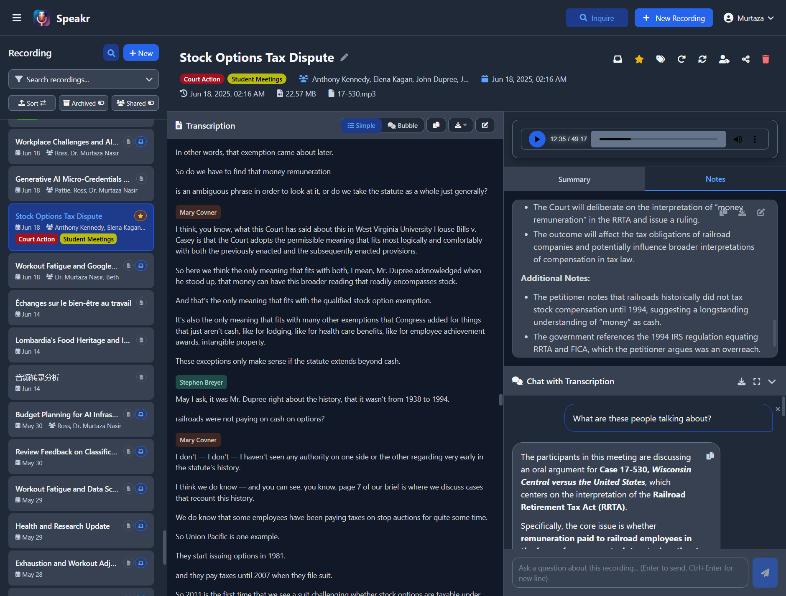
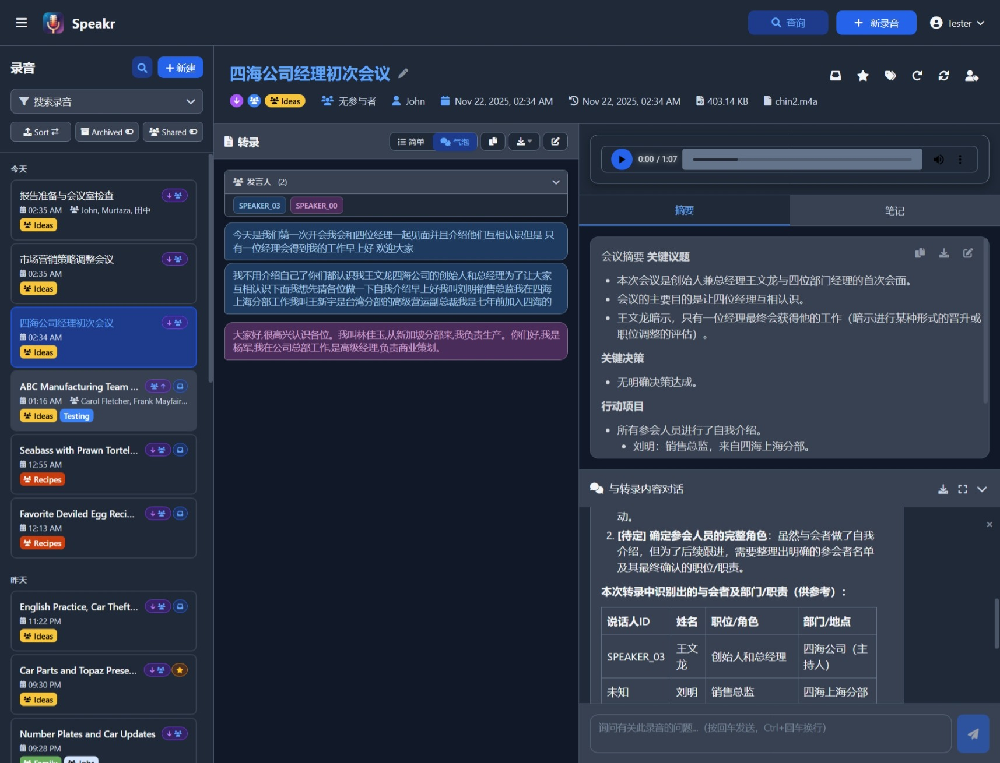

<div align="center">
    
</div>

<h1 align="center">Speakr</h1>
<p align="center">Self-hosted AI transcription and intelligent note-taking platform</p>

<p align="center">
  <a href="https://www.gnu.org/licenses/agpl-3.0"></a>
  <a href="https://github.com/murtaza-nasir/speakr/actions/workflows/docker-publish.yml"></a>
  <a href="https://hub.docker.com/r/learnedmachine/speakr"></a>
  <a href="https://github.com/murtaza-nasir/speakr/releases/latest"></a>
</p>

<p align="center">
  <a href="https://murtaza-nasir.github.io/speakr">Documentation</a> •
  <a href="https://murtaza-nasir.github.io/speakr/getting-started">Quick Start</a> •
  <a href="https://murtaza-nasir.github.io/speakr/screenshots">Screenshots</a> •
  <a href="https://hub.docker.com/r/learnedmachine/speakr">Docker Hub</a> •
  <a href="https://github.com/murtaza-nasir/speakr/releases">Releases</a>
</p>

---

## Overview

Speakr transforms your audio recordings into organized, searchable, and intelligent notes. Built for privacy-conscious groups and individuals, it runs entirely on your own infrastructure, ensuring your sensitive conversations remain completely private.

<div align="center">
    
</div>

## Key Features

### Core Functionality
- **Smart Recording & Upload** - Record directly in browser or upload existing audio files
- **AI Transcription** - High-accuracy transcription with speaker identification
- **Voice Profiles** - AI-powered speaker recognition with voice embeddings (requires WhisperX ASR service)
- **REST API v1** - Complete API with Swagger UI for automation tools (n8n, Zapier, Make) and dashboard widgets
- **Single Sign-On** - Authenticate with any OIDC provider (Keycloak, Azure AD, Google, Auth0, Pocket ID)
- **Audio-Transcript Sync** - Click transcript to jump to audio, auto-highlight current text, follow mode for hands-free playback
- **Interactive Chat** - Ask questions about your recordings and get AI-powered answers
- **Inquire Mode** - Semantic search across all recordings using natural language
- **Internationalization** - Full support for English, Spanish, French, German, Chinese, and Russian
- **Beautiful Themes** - Light and dark modes with customizable color schemes

### Collaboration & Sharing
- **Internal Sharing** - Share recordings with specific users with granular permissions (view/edit/reshare)
- **Group Management** - Create groups with automatic sharing via group-scoped tags
- **Public Sharing** - Generate secure links to share recordings externally (admin-controlled)
- **Group Tags** - Tags that automatically share recordings with all group members

### Organization & Management
- **Smart Tagging** - Organize with tags that include custom AI prompts and ASR settings
- **Tag Prompt Stacking** - Combine multiple tags to layer AI instructions for powerful transformations
- **Tag Protection** - Prevent specific recordings from being auto-deleted
- **Group Retention Policies** - Set custom retention periods per group tag
- **Auto-Deletion** - Automatic cleanup of old recordings with flexible retention policies

## Real-World Use Cases

Different people use Speakr's collaboration and retention features in different ways:

| Use Case | Setup | What It Does |
|----------|-------|-------------|
| **Family memories** | Create "Family" group with protected tag | Everyone gets access to trips and events automatically, recordings preserved forever |
| **Book club discussions** | "Book Club" group, tag monthly meetings | All members auto-share discussions, can add personal notes about what resonated |
| **Work project group** | Share individually with 3 teammates | Temporary collaboration, easy to revoke when project ends |
| **Daily group standups** | Group tag with 14-day retention | Auto-share with group, auto-cleanup of routine meetings |
| **Architecture decisions** | Engineering group tag, protected from deletion | Technical discussions automatically shared, preserved permanently as reference |
| **Client consultations** | Individual share with view-only permission | Controlled external access, clients can't accidentally edit |
| **Research interviews** | Protected tag + Obsidian export | Preserve recordings indefinitely, transcripts auto-import to note-taking system |
| **Legal consultations** | Group tag with 7-year retention | Automatic sharing with legal group, compliance-based retention |
| **Sales calls** | Group tag with 1-year retention | Whole sales group learns from each call, cleanup after sales cycle |

### Creative Tag Prompt Examples

Tags with custom prompts transform raw recordings into exactly what you need:

- **Recipe recordings**: Record yourself cooking while narrating - tag with "Recipe" to convert messy speech into formatted recipes with ingredient lists and numbered steps
- **Lecture notes**: Students tag lectures with "Study Notes" to get organized outlines with concepts, examples, and definitions instead of raw transcripts
- **Code reviews**: "Code Review" tag extracts issues, suggested changes, and action items in technical language developers can use directly
- **Meeting summaries**: "Action Items" tag ignores discussion and returns just decisions, tasks, and deadlines

### Tag Stacking for Combined Effects

Stack multiple tags to layer instructions:
- "Recipe" + "Gluten Free" = Formatted recipe with gluten substitution suggestions
- "Lecture" + "Biology 301" = Study notes format focused on biological terminology
- "Client Meeting" + "Legal Review" = Client requirements plus legal implications highlighted

The order can matter - start with format tags, then add focus tags for best results.

### Integration Examples

- **Obsidian/Logseq**: Enable auto-export to write completed transcripts directly to your vault using your custom template - no manual export needed
- **Documentation wikis**: Map auto-export to your wiki's import folder for seamless transcript publishing
- **Content creation**: Create SRT subtitle templates from your audio recordings for podcasts or video content
- **Project management**: Extract action items with custom tag prompts, then auto-export for automated task creation

## Quick Start

### Using Docker (Recommended)

```bash
# Create project directory
mkdir speakr && cd speakr

# Download docker-compose configuration:
wget https://raw.githubusercontent.com/murtaza-nasir/speakr/master/config/docker-compose.example.yml -O docker-compose.yml

# Download the environment template:
wget https://raw.githubusercontent.com/murtaza-nasir/speakr/master/config/env.transcription.example -O .env

# Configure your API keys and launch
nano .env
docker compose up -d

# Access at http://localhost:8899
```

**Required API Keys:**
- `TRANSCRIPTION_API_KEY` - For speech-to-text (OpenAI) or `ASR_BASE_URL` for self-hosted
- `TEXT_MODEL_API_KEY` - For summaries, titles, and chat (OpenRouter or OpenAI)

### Transcription Options

Speakr uses a **connector-based architecture** that auto-detects your transcription provider:

| Option | Setup | Speaker Diarization | Voice Profiles |
|--------|-------|---------------------|----------------|
| **OpenAI Transcribe** | Just API key | ✅ `gpt-4o-transcribe-diarize` | ❌ |
| **WhisperX ASR** | GPU container | ✅ Best quality | ✅ |
| **Legacy Whisper** | Just API key | ❌ | ❌ |

**Simplest setup (OpenAI with diarization):**
```bash
TRANSCRIPTION_API_KEY=sk-your-openai-key
TRANSCRIPTION_MODEL=gpt-4o-transcribe-diarize
```

**Best quality (Self-hosted WhisperX):**
```bash
ASR_BASE_URL=http://whisperx-asr:9000
ASR_RETURN_SPEAKER_EMBEDDINGS=true  # Enable voice profiles
```
Requires [WhisperX ASR Service](https://github.com/murtaza-nasir/whisperx-asr-service) container with GPU.

> **⚠️ PyTorch 2.6 Users:** If you encounter a "Weights only load failed" error with WhisperX, add `TORCH_FORCE_NO_WEIGHTS_ONLY_LOAD=true` to your ASR container. See [troubleshooting](https://murtaza-nasir.github.io/speakr/troubleshooting#pytorch-26-weights-loading-error-whisperx-asr-service) for details.

**[View Full Installation Guide →](https://murtaza-nasir.github.io/speakr/getting-started/installation)**

## Documentation

Complete documentation is available at **[murtaza-nasir.github.io/speakr](https://murtaza-nasir.github.io/speakr)**

- [Getting Started](https://murtaza-nasir.github.io/speakr/getting-started) - Quick setup guide
- [User Guide](https://murtaza-nasir.github.io/speakr/user-guide/) - Learn all features
- [Admin Guide](https://murtaza-nasir.github.io/speakr/admin-guide/) - Administration and configuration
- [Troubleshooting](https://murtaza-nasir.github.io/speakr/troubleshooting) - Common issues and solutions
- [FAQ](https://murtaza-nasir.github.io/speakr/faq) - Frequently asked questions

## Latest Release (v0.8.2)

**Transcription Usage Tracking**

- **Per-User Budgets** - Set monthly transcription limits (in minutes) with 80% warning and 100% blocking
- **Usage Dashboard** - Track minutes, costs, and per-user breakdowns in Admin panel
- **Cost Estimation** - Automatic pricing for OpenAI Whisper/Transcribe and self-hosted ASR
- **REST API** - `/api/v1/stats` now includes transcription usage and budget data

### Previous Release (v0.8.1)

**Bug Fixes**

- **Diarization for Long Files** - Fixed speaker diarization for chunked files with OpenAI's `gpt-4o-transcribe-diarize`
- **Empty Segment Filtering** - Removed empty transcript segments from diarized output

### Previous Release (v0.8.0)

**Cloud Diarization & REST API**

- **Speaker Diarization Without GPU** - Use OpenAI's `gpt-4o-transcribe-diarize` for speaker identification with just an API key
- **REST API v1** - Full-featured API for automation tools (n8n, Zapier, Make) and dashboard widgets
- **Connector Architecture** - Modular transcription providers with simplified configuration

### Previous Release (v0.7.2)

**Token Budgets, Performance & UX**

- **Token Usage Tracking** - Track LLM token usage per user with detailed statistics and cost breakdowns
- **Per-User Token Budgets** - Set monthly token limits per user with warnings at 80% and blocking at 100%
- **Virtual Scrolling** - Performance optimization for handling 4500+ transcript segments smoothly
- **Audio Player Improvements** - Drag-to-seek, independent modal players, improved theme support
- **File Date Handling** - Uses original recording date from file metadata instead of upload time
- **Codec Configuration** - Configure unsupported audio codecs with automatic conversion

### Previous Release (v0.7.1)

- **PostgreSQL Support** - Added `psycopg2-binary` driver for PostgreSQL database option
- **Audio Download Button** - Explicit download button next to audio player, works on mobile
- **Job Queue Race Condition Fix** - Fixed issue where multiple workers could claim the same job

*Thanks to [sakowicz](https://github.com/sakowicz), [JadedBlueEyes](https://github.com/JadedBlueEyes), and [Daabramov](https://github.com/Daabramov)*

### Previous Release (v0.7.0)

- **SSO Authentication** - Sign in with any OIDC provider (Keycloak, Azure AD, Google, Auth0, Pocket ID)
- **Account Linking/Unlinking** - Link or unlink SSO from Account settings
- **Enforce SSO-only** - Disable password login for regular users

*Contributed by [Dmitry Abramov](https://github.com/Daabramov)* | [SSO Setup Guide](https://murtaza-nasir.github.io/speakr/admin-guide/sso-setup/)

### v0.5.9 - Major Release

> **⚠️ IMPORTANT:** v0.5.9 introduced significant architectural changes. If upgrading from earlier versions, backup your data first and review the [configuration guide](https://murtaza-nasir.github.io/speakr/getting-started/installation#configuration-updates).

#### Highlights
- **Complete Internal Sharing System** - Share recordings with users with granular permissions (view/edit/reshare)
- **Group Management & Collaboration** - Create groups with auto-sharing via group tags and custom retention policies
- **Speaker Voice Profiles** - AI-powered speaker identification with 256-dimensional voice embeddings
- **Audio-Transcript Synchronization** - Click-to-jump, auto-highlight, and follow mode for interactive navigation
- **Auto-Deletion & Retention System** - Flexible retention policies with global and group-level controls
- **Automated Export** - Auto-export transcriptions to markdown for Obsidian, Logseq, and other note-taking apps
- **Permission System** - Fine-grained access control throughout the application
- **Modular Architecture** - Backend refactored into blueprints, frontend composables for maintainability
- **UI/UX Enhancements** - Compact controls, inline editing, unified toast notifications, improved badges
- **Enhanced Internationalization** - 29 new tooltip translations across all supported languages

## Screenshots

<table align="center" border="0">
  <tr>
    <td align="center">
      
      <br><em>Main Screen with Chat</em>
    </td>
    <td align="center">
      
      <br><em>AI-Powered Semantic Search</em>
    </td>
  </tr>
  <tr>
    <td align="center">
      
      <br><em>Interactive Transcription & Chat</em>
    </td>
    <td align="center">
      
      <br><em>Full Internationalization</em>
    </td>
  </tr>
</table>

**[View Full Screenshot Gallery →](https://murtaza-nasir.github.io/speakr/screenshots)**

## Technology Stack

- **Backend**: Python/Flask with SQLAlchemy
- **Frontend**: Vue.js 3 with Tailwind CSS
- **AI/ML**: OpenAI Whisper, OpenRouter, Ollama support
- **Database**: SQLite (default) or PostgreSQL
- **Deployment**: Docker, Docker Compose

## Roadmap

### Completed
- ✅ Speaker voice profiles with AI-powered identification (v0.5.9)
- ✅ Group workspaces with shared recordings (v0.5.9)
- ✅ PWA enhancements with offline support and background sync (v0.5.10)
- ✅ Multi-user job queue with fair scheduling (v0.6.0)
- ✅ SSO integration with OIDC providers (v0.7.0)
- ✅ Token usage tracking and per-user budgets (v0.7.2)
- ✅ Connector-based transcription architecture with auto-detection (v0.8.0)
- ✅ Comprehensive REST API with Swagger UI documentation (v0.8.0)

### Near-term
- Quick language switching for transcription
- Automated workflow triggers

### Long-term
- Plugin system for custom integrations
- End-to-end encryption option

### Reporting Issues

- [Report bugs](https://github.com/murtaza-nasir/speakr/issues)
- [Request features](https://github.com/murtaza-nasir/speakr/discussions)

## License

This project is **dual-licensed**:

1.  **GNU Affero General Public License v3.0 (AGPLv3)**
    [](https://www.gnu.org/licenses/agpl-3.0)

    Speakr is offered under the AGPLv3 as its open-source license. You are free to use, modify, and distribute this software under the terms of the AGPLv3. A key condition of the AGPLv3 is that if you run a modified version on a network server and provide access to it for others, you must also make the source code of your modified version available to those users under the AGPLv3.

    * You **must** create a file named `LICENSE` (or `COPYING`) in the root of your repository and paste the full text of the [GNU AGPLv3 license](https://www.gnu.org/licenses/agpl-3.0.txt) into it.
    * Read the full license text carefully to understand your rights and obligations.

2.  **Commercial License**

    For users or organizations who cannot or do not wish to comply with the terms of the AGPLv3 (for example, if you want to integrate Speakr into a proprietary commercial product or service without being obligated to share your modifications under AGPLv3), a separate commercial license is available.

    Please contact **speakr maintainers** for details on obtaining a commercial license.

**You must choose one of these licenses** under which to use, modify, or distribute this software. If you are using or distributing the software without a commercial license agreement, you must adhere to the terms of the AGPLv3.

## Contributing

We welcome contributions to Speakr! There are many ways to help:

- **Bug Reports & Feature Requests**: [Open an issue](https://github.com/murtaza-nasir/speakr/issues)
- **Discussions**: [Share ideas and ask questions](https://github.com/murtaza-nasir/speakr/discussions)
- **Documentation**: Help improve our docs
- **Translations**: Contribute translations for internationalization

### Code Contributions

All code contributions require signing a [Contributor License Agreement (CLA)](CLA.md). This one-time process ensures we can maintain our dual-license model (AGPLv3 and Commercial).

**See our [Contributing Guide](CONTRIBUTING.md) for complete details on:**
- How the CLA works and why we need it
- Step-by-step contribution process
- Development setup instructions
- Coding standards and best practices

The CLA is automatically enforced via GitHub Actions. When you submit your first PR, our bot will guide you through signing.
