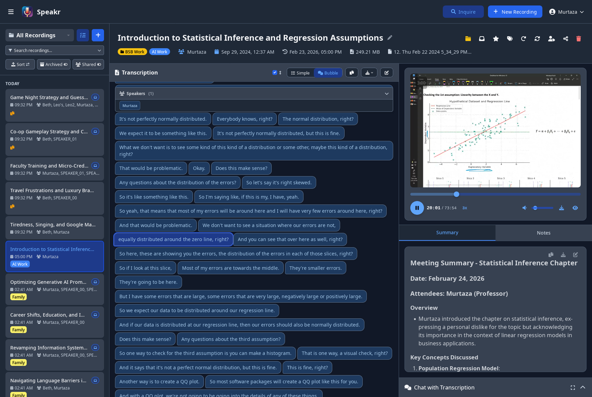
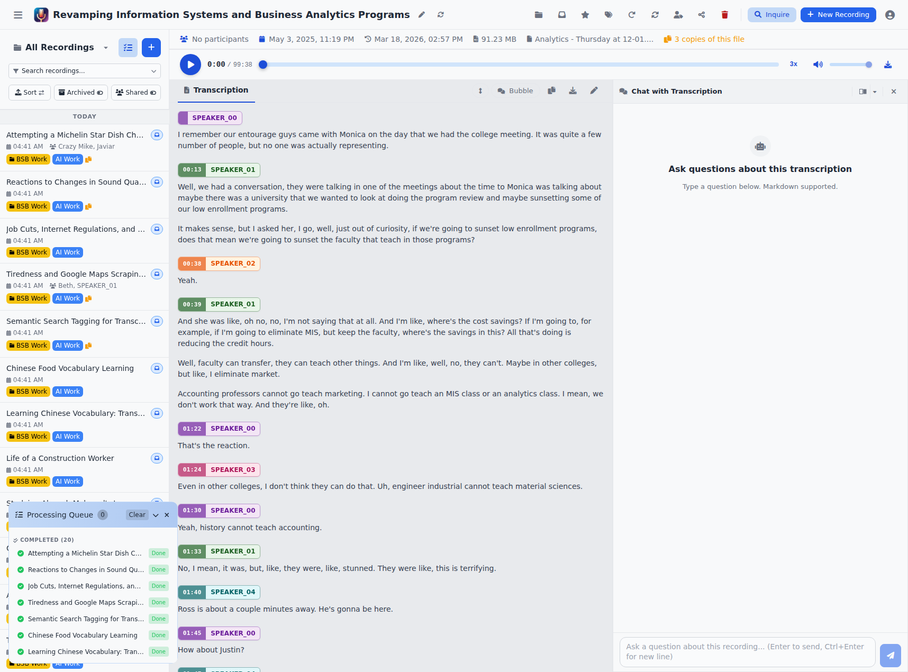

<div align="center">
    
</div>

<h1 align="center">Speakr</h1>
<p align="center">Self-hosted AI transcription and intelligent note-taking platform</p>

<p align="center">
  <a href="https://www.gnu.org/licenses/agpl-3.0"></a>
  <a href="https://github.com/murtaza-nasir/speakr/actions/workflows/docker-publish.yml"></a>
  <a href="https://hub.docker.com/r/learnedmachine/speakr"></a>
  <a href="https://github.com/murtaza-nasir/speakr/releases/latest"></a>
</p>

<p align="center">
  <a href="https://murtaza-nasir.github.io/speakr">Documentation</a> •
  <a href="https://murtaza-nasir.github.io/speakr/getting-started">Quick Start</a> •
  <a href="https://murtaza-nasir.github.io/speakr/screenshots">Screenshots</a> •
  <a href="https://hub.docker.com/r/learnedmachine/speakr">Docker Hub</a> •
  <a href="https://github.com/murtaza-nasir/speakr/releases">Releases</a>
</p>

---

## Overview

Speakr transforms your audio recordings into organized, searchable, and intelligent notes. Built for privacy-conscious groups and individuals, it runs entirely on your own infrastructure, ensuring your sensitive conversations remain completely private.

<div align="center">
    
</div>

## Key Features

### Core Functionality
- **Smart Recording & Upload** - Record directly in browser or upload existing audio files
- **AI Transcription** - High-accuracy transcription with speaker identification
- **Voice Profiles** - AI-powered speaker recognition with voice embeddings (requires WhisperX ASR service)
- **REST API v1** - Complete API with Swagger UI for automation tools (n8n, Zapier, Make) and dashboard widgets
- **Single Sign-On** - Authenticate with any OIDC provider (Keycloak, Azure AD, Google, Auth0, Pocket ID)
- **Audio-Transcript Sync** - Click transcript to jump to audio, auto-highlight current text, follow mode for hands-free playback
- **Interactive Chat** - Ask questions about your recordings and get AI-powered answers
- **Inquire Mode** - Semantic search across all recordings using natural language
- **Internationalization** - Full support for English, Spanish, French, German, Chinese, and Russian
- **Beautiful Themes** - Light and dark modes with customizable color schemes

### Collaboration & Sharing
- **Internal Sharing** - Share recordings with specific users with granular permissions (view/edit/reshare)
- **Group Management** - Create groups with automatic sharing via group-scoped tags
- **Public Sharing** - Generate secure links to share recordings externally (admin-controlled)
- **Group Tags** - Tags that automatically share recordings with all group members

### Organization & Management
- **Smart Tagging** - Organize with tags that include custom AI prompts and ASR settings
- **Tag Prompt Stacking** - Combine multiple tags to layer AI instructions for powerful transformations
- **Tag Protection** - Prevent specific recordings from being auto-deleted
- **Group Retention Policies** - Set custom retention periods per group tag
- **Auto-Deletion** - Automatic cleanup of old recordings with flexible retention policies

## Real-World Use Cases

Different people use Speakr's collaboration and retention features in different ways:

| Use Case | Setup | What It Does |
|----------|-------|-------------|
| **Family memories** | Create "Family" group with protected tag | Everyone gets access to trips and events automatically, recordings preserved forever |
| **Book club discussions** | "Book Club" group, tag monthly meetings | All members auto-share discussions, can add personal notes about what resonated |
| **Work project group** | Share individually with 3 teammates | Temporary collaboration, easy to revoke when project ends |
| **Daily group standups** | Group tag with 14-day retention | Auto-share with group, auto-cleanup of routine meetings |
| **Architecture decisions** | Engineering group tag, protected from deletion | Technical discussions automatically shared, preserved permanently as reference |
| **Client consultations** | Individual share with view-only permission | Controlled external access, clients can't accidentally edit |
| **Research interviews** | Protected tag + Obsidian export | Preserve recordings indefinitely, transcripts auto-import to note-taking system |
| **Legal consultations** | Group tag with 7-year retention | Automatic sharing with legal group, compliance-based retention |
| **Sales calls** | Group tag with 1-year retention | Whole sales group learns from each call, cleanup after sales cycle |

### Creative Tag Prompt Examples

Tags with custom prompts transform raw recordings into exactly what you need:

- **Recipe recordings**: Record yourself cooking while narrating - tag with "Recipe" to convert messy speech into formatted recipes with ingredient lists and numbered steps
- **Lecture notes**: Students tag lectures with "Study Notes" to get organized outlines with concepts, examples, and definitions instead of raw transcripts
- **Code reviews**: "Code Review" tag extracts issues, suggested changes, and action items in technical language developers can use directly
- **Meeting summaries**: "Action Items" tag ignores discussion and returns just decisions, tasks, and deadlines

### Tag Stacking for Combined Effects

Stack multiple tags to layer instructions:
- "Recipe" + "Gluten Free" = Formatted recipe with gluten substitution suggestions
- "Lecture" + "Biology 301" = Study notes format focused on biological terminology
- "Client Meeting" + "Legal Review" = Client requirements plus legal implications highlighted

The order can matter - start with format tags, then add focus tags for best results.

### Integration Examples

- **Obsidian/Logseq**: Enable auto-export to write completed transcripts directly to your vault using your custom template - no manual export needed
- **Documentation wikis**: Map auto-export to your wiki's import folder for seamless transcript publishing
- **Content creation**: Create SRT subtitle templates from your audio recordings for podcasts or video content
- **Project management**: Extract action items with custom tag prompts, then auto-export for automated task creation

## Quick Start

### Using Docker (Recommended)

```bash
# Create project directory
mkdir speakr && cd speakr

# Download docker-compose configuration:
wget https://raw.githubusercontent.com/murtaza-nasir/speakr/master/config/docker-compose.example.yml -O docker-compose.yml

# Download the environment template:
wget https://raw.githubusercontent.com/murtaza-nasir/speakr/master/config/env.transcription.example -O .env

# Configure your API keys and launch
nano .env
docker compose up -d

# Access at http://localhost:8899
```

> **Lightweight image:** Use `learnedmachine/speakr:lite` for a smaller image (~725MB vs ~4.4GB) that skips PyTorch. All features work normally — only Inquire Mode's semantic search falls back to basic text search.

**Required API Keys:**
- `TRANSCRIPTION_API_KEY` - For speech-to-text (OpenAI) or `ASR_BASE_URL` for self-hosted
- `TEXT_MODEL_API_KEY` - For summaries, titles, and chat (OpenRouter or OpenAI)

### Transcription Options

Speakr uses a **connector-based architecture** that auto-detects your transcription provider:

| Option | Setup | Speaker Diarization | Voice Profiles |
|--------|-------|---------------------|----------------|
| **OpenAI Transcribe** | Just API key | ✅ `gpt-4o-transcribe-diarize` | ❌ |
| **WhisperX ASR** | GPU container | ✅ Best quality | ✅ |
| **Mistral Voxtral** | Just API key | ✅ Built-in | ❌ |
| **VibeVoice ASR** | Self-hosted (vLLM) | ✅ Built-in | ❌ |
| **Legacy Whisper** | Just API key | ❌ | ❌ |

**Simplest setup (OpenAI with diarization):**
```bash
TRANSCRIPTION_API_KEY=sk-your-openai-key
TRANSCRIPTION_MODEL=gpt-4o-transcribe-diarize
```

**Best quality (Self-hosted WhisperX):**
```bash
ASR_BASE_URL=http://whisperx-asr:9000
ASR_RETURN_SPEAKER_EMBEDDINGS=true  # Enable voice profiles
```
Requires [WhisperX ASR Service](https://github.com/murtaza-nasir/whisperx-asr-service) container with GPU.

**Mistral Voxtral (cloud diarization):**
```bash
TRANSCRIPTION_CONNECTOR=mistral
TRANSCRIPTION_API_KEY=your-mistral-key
TRANSCRIPTION_MODEL=voxtral-mini-latest
```

**VibeVoice ASR (self-hosted, no cloud dependency):**
```bash
TRANSCRIPTION_CONNECTOR=vibevoice
TRANSCRIPTION_BASE_URL=http://your-vllm-server:8000
TRANSCRIPTION_MODEL=vibevoice
```
Requires [VibeVoice](https://huggingface.co/microsoft/VibeVoice-ASR) served via vLLM with GPU.

> **⚠️ PyTorch 2.6 Users:** If you encounter a "Weights only load failed" error with WhisperX, add `TORCH_FORCE_NO_WEIGHTS_ONLY_LOAD=true` to your ASR container. See [troubleshooting](https://murtaza-nasir.github.io/speakr/troubleshooting#pytorch-26-weights-loading-error-whisperx-asr-service) for details.

**[View Full Installation Guide →](https://murtaza-nasir.github.io/speakr/getting-started/installation)**

## Documentation

Complete documentation is available at **[murtaza-nasir.github.io/speakr](https://murtaza-nasir.github.io/speakr)**

- [Getting Started](https://murtaza-nasir.github.io/speakr/getting-started) - Quick setup guide
- [User Guide](https://murtaza-nasir.github.io/speakr/user-guide/) - Learn all features
- [Admin Guide](https://murtaza-nasir.github.io/speakr/admin-guide/) - Administration and configuration
- [Troubleshooting](https://murtaza-nasir.github.io/speakr/troubleshooting) - Common issues and solutions
- [FAQ](https://murtaza-nasir.github.io/speakr/faq) - Frequently asked questions

## Latest Release (v0.8.17-alpha)

**Bug fixes and CI maintenance.** Patch release on top of v0.8.16-alpha.

- Reprocess summary modal: prompt-variables panel and Append/Replace toggle now reflect the prompt source the user actually picked (was showing the recording's original tag variables and offering Append/Replace for tag-source prompts where it does not apply)
- Docs: corrected reverse-proxy nginx example so the WebSocket `Connection: upgrade` header is forwarded conditionally rather than set unconditionally (caused 500s on file uploads through the proxy with Gunicorn). Added a Nginx Proxy Manager section noting that NPM's default `client_max_body_size` is `2000m` and that the `Advanced` tab is the right place for per-host overrides.
- CI: bumped all GitHub Actions to Node 24 versions to clear deprecation warnings.

No new features, no breaking changes.

### Previous Release (v0.8.16-alpha)

**Prompt Templating, Transcription UX Polish, Per-Recording Model Selection, and Observability**

**Prompt templating and summary control**

- **Prompt Template Variables** - Tag, folder, user-default, and admin-default summary prompts can contain `{{name}}` placeholders. Selecting a tag with `{{agenda}}` exposes an agenda input on the upload form; the value is stored on the recording, substituted into the prompt at summarisation time, and remains editable from the reprocess summary modal. Caps: 8,000 chars per value, 32,000 total. Single-pass `re.sub` substitution so values cannot introduce new placeholders or reach Python attributes.
- **Append vs Replace Mode** - The reprocess summary modal and the new "Customise summary prompt" modal each let you Append text to the resolved prompt (combine your saved prompt with extra context) or Replace it entirely (use only the text you paste). Append mode runs variable substitution after the append step so appended text can use the same `{{var}}` placeholders.
- **Customise Summary Prompt Split-Button** - A new control next to **Generate Summary** opens the Append/Replace modal for recordings that don't have a summary yet, so one-off context (an agenda, custom focus instructions) can be passed in without rewriting your saved prompt.
- **Full LLM Prompt Structure Preview** - Both the admin Default Prompts page and the user Customise-prompts tab now show the complete two-message payload (system prompt with context block, user message with transcription wrapper and language directive). Placeholder chips colour-code system tokens (blue, replaced by the framework) versus user-supplied variables (amber). The user-side preview re-renders live as you type into your custom prompt.

**Per-recording transcription control**

- **Per-Upload / Per-Tag / Per-Folder Transcription Model** - Set `TRANSCRIPTION_MODELS_AVAILABLE` and the upload form, reprocess modal, and tag/folder edit forms all gain a model dropdown. Tag and folder edit forms warn if a previously-selected default is no longer in the configured list. The dropdown is hidden when only one option would be visible.
- **Admin-Managed Transcription Model List** - When the connector exposes `/v1/models` discovery, admins can curate the list from the dashboard rather than via env var. Stored in the database; overrides `TRANSCRIPTION_MODELS_AVAILABLE` when set.
- **Per-Connector Capability Gating** - The hotwords, initial-prompt, and speaker-count UI elements are now hidden for connectors that don't support them, instead of accepting input that is silently ignored.
- **Mistral Voxtral Chunking** - `MISTRAL_ENABLE_CHUNKING=true` (with `MISTRAL_MAX_DURATION_SECONDS`) opts the Mistral connector into app-side chunking for recordings approaching Voxtral's 3-hour timeout.

**ASR transcript editor**

- **Autosave** - Saves edits 2 seconds after the last keystroke when the user opts in (`Account → Preferences → Autosave editor`).
- **Save Without Closing + Ctrl+S** - New button keeps the editor open after saving; Ctrl+S triggers a save from anywhere in the editor.
- **Scroll Memory** - Reopening the editor restores the previous scroll position instead of jumping to the top.
- **Double-Click to Edit** - Double-clicking a transcript row in the simple view jumps into the editor with that segment highlighted.
- **Row Highlight After Jump** - Briefly tints the row when navigating into it from the simple view so the target is obvious.

**Account preferences**

- **Preferences Tab** - Account settings has a new **Preferences** tab (split from the language settings) using a two-column layout for transcript display, editor behaviour, and language preferences.
- **Compact Timestamps** - Optional `mm:ss` (or `h:mm:ss`) timestamps in the simple transcript view, rendered as a two-part pill alongside the speaker label. The leading segment shows "Start" instead of `00:00`.
- **Persist Recording-List Sort** - The Created date / Meeting date toggle now sticks across reloads and sessions on the same browser (#263).

**Embeddings and inquire mode**

- **Configurable Embedding Model** - `EMBEDDING_MODEL` swaps `all-MiniLM-L6-v2` for any sentence-transformers model.
- **API-Mode Embeddings** - `EMBEDDING_BASE_URL`, `EMBEDDING_API_KEY`, and `EMBEDDING_DIMENSIONS` route embeddings through any OpenAI-compatible provider (vLLM, OpenRouter, OpenAI, Together, etc.). Inquire startup banner reflects the active provider.
- **Embedding Token Tracking + Re-Embed-All** - The Vector Store admin tab now tracks embedding API token usage and cost separately from LLM usage, and exposes a "Re-embed all" action for after a model or dimensionality change. Speakr warns at startup if the embedding identifier changed since data was stored.

**Observability and admin**

- **Per-Operation Token Stats** - Admin token statistics now break out title, summary, chat, event extraction, and embeddings as separate categories with their own cards and charts. Embedding usage is shown as a distinct cost line.
- **Granular Token Budgets** - `TITLE_MAX_TOKENS` and `EVENT_MAX_TOKENS` join the existing `SUMMARY_MAX_TOKENS` / `CHAT_MAX_TOKENS` so reasoning models that consume budget on hidden thinking tokens can be tuned per operation. The resolved `max_tokens` is logged with each LLM call.
- **LLM Timeout Visibility** - The configured `LLM_REQUEST_TIMEOUT` is logged at startup, and `APITimeoutError` log entries now include elapsed time so it is clear whether the timeout was the actual bound that fired.

**API v1**

- **Folder CRUD** - New `/api/v1/folders` endpoints for list, create, update, delete.
- **Connector Discovery** - New endpoint exposing the active transcription connector and its capabilities for companion-app integrations.
- **Recording Field Parity** - `/api/v1/recordings` and `/api/v1/recordings/{id}` now expose `audio_duration`, transcription/summarization durations, folder, events (detail only), `deletion_exempt`, `prompt_variables`, and the per-recording transcription model.
- **Forwarded Per-Request Overrides** - The `/api/v1/transcribe` endpoint now forwards `transcription_model`, `hotwords`, and `initial_prompt`. The custom-ASR-endpoint connector forwards a `?model=` query param so WhisperX runtime model switching works through the API.

**Bug fixes**

- Reprocessing now applies tag/folder/user default hotwords + initial_prompt (#265, previously only at upload time)
- Legacy user records with `transcription_language="français"` are normalised to ISO 639-1 codes on upgrade so WhisperX no longer 500s on display names (#256)
- Title generation no longer leaks `\\uXXXX` escape sequences into the LLM prompt for non-ASCII transcripts; truncation now happens after `format_transcription_for_llm` (#260)
- The Vector Store "recordings to process" message now uses the i18n params API instead of inline brace replace
- CSRF token added to the Preferences form so submissions are accepted

**Infrastructure**

- **Vitest Frontend Tests** - Pure-helper modules in `static/js/modules/utils/` are now covered by Vitest. Run `npm test`. Currently exercises the prompt-variable extraction and priority-chain logic.

**Docs**

- nginx reverse-proxy `proxy_request_buffering off` and `client_max_body_size` notes for large uploads
- Google Gemini OpenAI-compatible endpoint setup example
- Prompt template variables guide
- Per-upload / per-tag / per-folder model selection documentation
- `EMBEDDING_BASE_URL` API mode documentation across inquire-mode, vector-store, and troubleshooting

---

**Older releases:** see the [GitHub Releases page](https://github.com/murtaza-nasir/speakr/releases) for tagged versions, or the [release history on the docs site](https://murtaza-nasir.github.io/speakr/#latest-updates) for narrative changelog entries going back to earlier v0.x lines.

## Screenshots

<table align="center" border="0">
  <tr>
    <td align="center">
      
      <br><em>Main Screen with Chat</em>
    </td>
    <td align="center">
      
      <br><em>Video Playback with Transcript</em>
    </td>
  </tr>
  <tr>
    <td align="center">
      
      <br><em>AI-Powered Semantic Search</em>
    </td>
    <td align="center">
      
      <br><em>Interactive Transcription & Chat</em>
    </td>
  </tr>
</table>

**[View Full Screenshot Gallery →](https://murtaza-nasir.github.io/speakr/screenshots)**

## Technology Stack

- **Backend**: Python/Flask with SQLAlchemy
- **Frontend**: Vue.js 3 with Tailwind CSS
- **AI/ML**: OpenAI Whisper, OpenRouter, Ollama support
- **Database**: SQLite (default) or PostgreSQL
- **Deployment**: Docker, Docker Compose

## Roadmap

### Completed
- ✅ Speaker voice profiles with AI-powered identification (v0.5.9)
- ✅ Group workspaces with shared recordings (v0.5.9)
- ✅ PWA enhancements with offline support and background sync (v0.5.10)
- ✅ Multi-user job queue with fair scheduling (v0.6.0)
- ✅ SSO integration with OIDC providers (v0.7.0)
- ✅ Token usage tracking and per-user budgets (v0.7.2)
- ✅ Connector-based transcription architecture with auto-detection (v0.8.0)
- ✅ Comprehensive REST API with Swagger UI documentation (v0.8.0)
- ✅ Video retention with in-browser video playback (v0.8.11)
- ✅ Parallel uploads with duplicate detection (v0.8.11)
- ✅ Fullscreen video mode with live subtitles (v0.8.14)
- ✅ Custom vocabulary and transcription hints (v0.8.14)

### Near-term
- Quick language switching for transcription
- Automated workflow triggers

### Long-term
- Plugin system for custom integrations
- End-to-end encryption option

### Reporting Issues

- [Report bugs](https://github.com/murtaza-nasir/speakr/issues)
- [Request features](https://github.com/murtaza-nasir/speakr/discussions)

## License

This project is **dual-licensed**:

1.  **GNU Affero General Public License v3.0 (AGPLv3)**
    [](https://www.gnu.org/licenses/agpl-3.0)

    Speakr is offered under the AGPLv3 as its open-source license. You are free to use, modify, and distribute this software under the terms of the AGPLv3. A key condition of the AGPLv3 is that if you run a modified version on a network server and provide access to it for others, you must also make the source code of your modified version available to those users under the AGPLv3.

    * You **must** create a file named `LICENSE` (or `COPYING`) in the root of your repository and paste the full text of the [GNU AGPLv3 license](https://www.gnu.org/licenses/agpl-3.0.txt) into it.
    * Read the full license text carefully to understand your rights and obligations.

2.  **Commercial License**

    For users or organizations who cannot or do not wish to comply with the terms of the AGPLv3 (for example, if you want to integrate Speakr into a proprietary commercial product or service without being obligated to share your modifications under AGPLv3), a separate commercial license is available.

    Please contact **speakr maintainers** for details on obtaining a commercial license.

**You must choose one of these licenses** under which to use, modify, or distribute this software. If you are using or distributing the software without a commercial license agreement, you must adhere to the terms of the AGPLv3.

## Contributing

We welcome contributions to Speakr! There are many ways to help:

- **Bug Reports & Feature Requests**: [Open an issue](https://github.com/murtaza-nasir/speakr/issues)
- **Discussions**: [Share ideas and ask questions](https://github.com/murtaza-nasir/speakr/discussions)
- **Documentation**: Help improve our docs
- **Translations**: Contribute translations for internationalization

### Code Contributions

By submitting a pull request, you agree to our [Contributor License Agreement (CLA)](CLA.md). This ensures we can maintain our dual-license model (AGPLv3 and Commercial). You retain copyright ownership of your contribution — the CLA simply grants us permission to include it in both the open source and commercial versions of Speakr. Our bot will post a reminder when you open a PR.

**See our [Contributing Guide](CONTRIBUTING.md) for complete details on:**
- How the CLA works and why we need it
- Step-by-step contribution process
- Development setup instructions
- Coding standards and best practices
