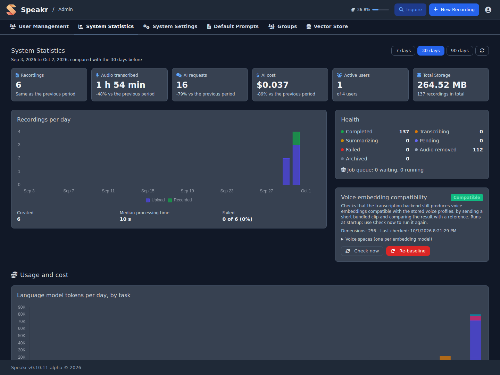

# System Statistics

The System Statistics tab shows how the instance is used, whether processing is healthy, and what the models cost. Choose a period of 7, 30 or 90 days at the top right. The period ends today, and each headline figure is compared with the period of the same length before it. Days are calendar days in UTC.

## Overview

Six cards sit at the top of the tab:

- **Recordings**: recordings created in the period.
- **Audio transcribed**: hours and minutes of audio sent for transcription.
- **AI requests**: language-model calls for titles, summaries, chat, events, speaker identification and Inquire. Embedding requests are not counted.
- **AI cost**: language-model, embedding and transcription cost together. It reads "Local" when every model runs locally and costs nothing.
- **Active users**: users who created at least one recording in the period, out of all users.
- **Total storage**: audio and video kept on disk, without recordings whose audio was removed.

The line under each figure gives the change against the previous period.

## Activity

**Recordings per day** stacks each day's new recordings by source: uploads (including the watch folder), recordings made in the browser, and merged recordings. Below the chart are the number created, the median processing time of the completed ones, and how many failed.

## Health

The Health card lists every recording state now, across all time: completed, transcribing, summarizing, pending, failed, audio removed and archived. The job queue line shows jobs waiting and running, and the jobs that failed in the last seven days. The latest failed recordings follow, with their owner, date and error message.

A queue that keeps growing points to a stopped or overloaded background worker. A run of failures with the same error usually means an expired API key, an unreachable transcription service or a wrong model name.

### Voice embedding compatibility

This card checks that the transcription backend still produces voice embeddings that match the stored voice profiles. It sends a short bundled clip and compares the result with a reference. The check runs at startup; **Check now** runs it again. **Voice spaces** lists one space per embedding model seen, with its dimensions, samples and calibrated threshold. Profiles are compared only within their own space, so switching back to an earlier backend brings its profiles back. **Re-baseline** discards the reference and cannot be undone.

## Usage and Cost

**Language model tokens per day, by task** stacks each day's tokens by operation: chat, summarization, title generation, event extraction, speaker identification and Inquire. When the backend reports prompt caching, a line below the chart gives the tokens read from and written to the cache in the period. Cache reads appear only when the text-generation backend returns them in its responses; see [Prefix-Cache-Friendly Prompts](model-configuration.md#prefix-cache-friendly-prompts-prefix_cache_optimized_prompts).

**Audio transcribed per day** and **Embedding tokens per day** are separate charts. Embedding volume is usually many times the language-model volume at a far lower price, so a shared axis would hide the language-model bars. A re-embed of the whole library shows up as one tall embedding bar.

**Cost per month** covers the last twelve calendar months, stacked by language model, embedding and transcription.

**Cost by model** lists every model used in the period with its requests, its volume (tokens, or minutes for transcription) and its cost. Language-model and embedding costs come from the provider's response where it reports one, such as OpenRouter, and otherwise from the configured price. Transcription cost is estimated from the connector:

- OpenAI Whisper API: $0.006 per minute
- OpenAI Transcribe (gpt-4o-transcribe): $0.006 per minute
- OpenAI Transcribe (gpt-4o-mini-transcribe): $0.003 per minute
- Self-hosted ASR endpoints: $0

## Users

The Users table has one row per user: recordings, storage, date of the last recording, and the tokens, transcription minutes and cost of the current calendar month. Monthly figures follow the calendar month whatever period is selected, because budgets reset each month. When a user has a budget, a bar shows how much of it is used:

- Green: under 80% of the budget
- Yellow: 80% to 100%; a warning icon appears next to the name
- Red: at or over 100%; the user is blocked until the next month

Click a column heading to sort by it. See [Token Budget Management](user-management.md#token-budget-management) and [Transcription Budget Management](user-management.md#transcription-budget-management) for setting the limits.

---

Next: [System Settings](system-settings.md) →
