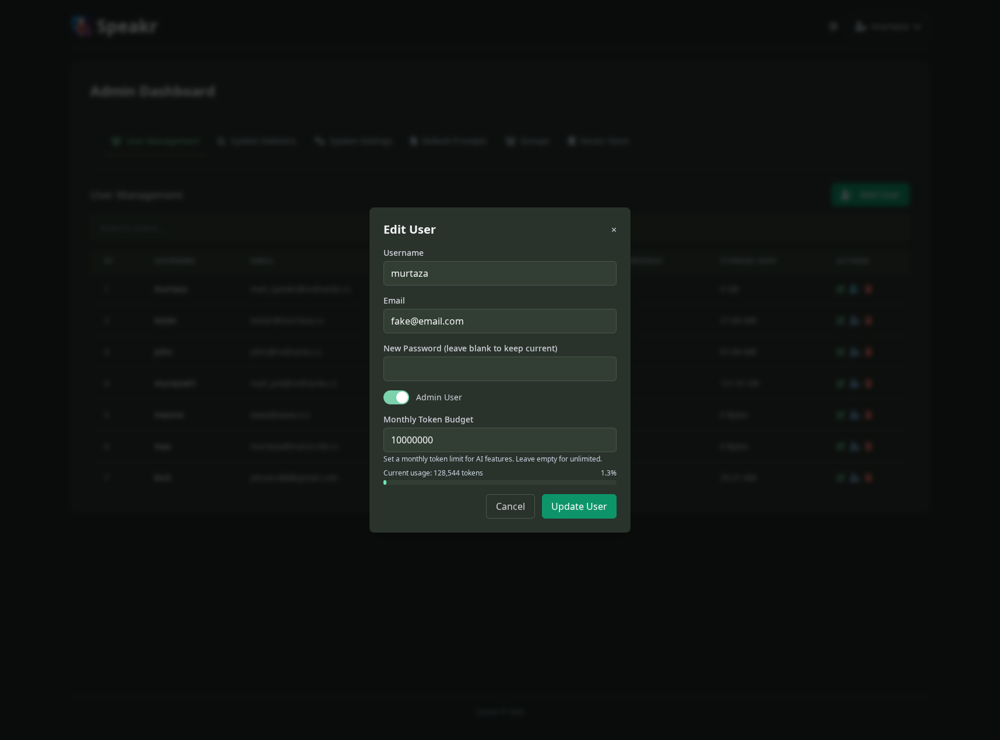

# User Management

The User Management tab is command central for controlling who has access to your Speakr instance and what they can do with it. Every user account flows through here, from initial creation to eventual removal, with all the monitoring and adjustments needed along the way. For system-wide usage patterns, check [system statistics](statistics.md).

## Understanding the User Table

When you open User Management, you're greeted with a comprehensive table showing every user in your system. Each row tells a story - the email address identifies the user, the admin badge shows their privilege level, the recording count reveals their activity level, and the storage measurement demonstrates their resource consumption.

The search bar at the top responds instantly as you type, filtering the table to help you find specific users quickly. This becomes invaluable as your user base grows beyond what fits on a single screen. The table updates in real-time when you make changes, so you always see the current state of your system.

## Adding New Users

Creating a user account starts with clicking the Add User button in the top right corner. The modal that appears asks for the essentials - username, email address, and password. You'll also decide immediately whether this person needs admin privileges, though you can always change this later.

The username becomes their identity within Speakr, appearing in the interface and organizing their recordings. The email address serves dual purposes - it's their login credential and their contact point for any system communications. The password you set is temporary; users should change it immediately after their first login through their [account settings](../user-guide/settings.md). Configure initial [language preferences](../user-guide/settings.md#language-preferences) and [custom prompts](../user-guide/settings.md#custom-prompts-tab).

Admin privileges are powerful and should be granted sparingly. Admin users can see and modify all [system settings](system-settings.md), manage other users including other admins, configure [default prompts](prompts.md), and monitor the [vector store](vector-store.md). Most users will never need these capabilities.

### User Permissions

Beyond the admin role, Speakr offers granular per-user permissions that control specific capabilities:

**Public Sharing Permission**: The public sharing icon button (globe icon) in each user's row toggles their ability to create public share links. When enabled (green), the user can generate secure links to share recordings externally with anyone. When disabled (gray), the user can only use internal sharing to share with other Speakr users. This permission is only available if `ENABLE_PUBLIC_SHARING=true` in your environment configuration.

Use this permission to control external information sharing on a per-user basis. You might grant public sharing to executives, sales groups, or marketing staff who regularly communicate with external stakeholders, while restricting it for users handling sensitive internal data.

### Token Budget Management

Control LLM costs by setting monthly token budgets for individual users. When creating or editing a user, you can specify a monthly token limit that restricts their AI usage.

**How Token Budgets Work**:

- **Warning at 80%**: Users see a yellow warning indicator when they reach 80% of their monthly budget
- **Blocked at 100%**: Once the budget is exhausted, AI operations (chat, summarization, etc.) are blocked until the next month
- **Budget Reset**: Token counts reset automatically at the start of each calendar month
- **No Limit**: Leave the budget field empty for unlimited usage

Token budgets are set in increments of 10,000 tokens with a minimum of 100,000. The budget covers all AI operations including summarization, chat, title generation, and event extraction. View detailed token usage statistics in the [System Statistics](statistics.md#token-usage-statistics) section.

### Transcription Budget Management

Control transcription costs by setting monthly transcription budgets for individual users. When creating or editing a user, you can specify a monthly limit (in minutes) that restricts their speech-to-text usage.

**How Transcription Budgets Work**:

- **Warning at 80%**: Users see a yellow warning indicator when they reach 80% of their monthly transcription budget
- **Blocked at 100%**: Once the budget is exhausted, new transcriptions are blocked until the next month
- **Budget Reset**: Transcription minutes reset automatically at the start of each calendar month
- **No Limit**: Leave the budget field empty for unlimited transcription usage

Transcription budgets are set in minutes with a minimum of 10 minutes. The budget covers all transcription operations regardless of which connector is used (OpenAI Whisper, OpenAI Transcribe, or self-hosted ASR). View detailed transcription usage statistics in the [System Statistics](statistics.md#transcription-usage-statistics) section.

**Cost Tracking**: The system tracks estimated costs based on the transcription connector used:
- **OpenAI Whisper**: $0.006 per minute
- **OpenAI Transcribe**: $0.003-$0.006 per minute depending on model
- **Self-hosted ASR**: $0 (no external API costs)

## Managing Existing Users

Each user row includes action buttons that give you complete control over that account. The edit button opens a modal where you can update their username or email address. This is useful when people change names, switch email providers, or when you need to correct initial entry mistakes.

The admin toggle is perhaps the most powerful single click in the interface. Promoting a user to admin grants them access to everything you can see and do. Demoting an admin back to regular user immediately revokes all their administrative capabilities. The system prevents you from removing admin rights from your own account, ensuring you can't accidentally lock yourself out.

The delete button requires careful consideration. Removing a user is permanent and cannot be undone through the interface. All their recordings, notes, and settings will be deleted along with their account. The system asks for confirmation, but once confirmed, the removal is immediate and complete.

## Monitoring Usage Patterns

The recording count and storage columns reveal how users interact with your Speakr instance. High recording counts might indicate power users who rely heavily on the system, while low counts could suggest users who need training or might not need accounts at all.

Storage consumption tells another important story. Users with disproportionately high storage might be uploading very long recordings, keeping everything indefinitely, or possibly misusing the system. You can adjust [file size limits](system-settings.md#maximum-file-size) and review [chunking settings](../troubleshooting.md#files-over-25mb-fail-with-openai) if needed. This information helps you have informed conversations about resource usage and establish appropriate policies.

Patterns often emerge when you regularly review this data. You might notice seasonal variations in academic settings, project-based spikes in corporate environments, or gradual growth that signals the need for infrastructure expansion.

## Security Implications

Every user account is a potential security vector. Strong passwords are your first defense, but they're not enough alone. Encourage users to use unique passwords, change them regularly, and never share them with others.

Admin accounts require extra vigilance. Each admin can do everything you can do, including creating more admins or deleting all users. Limit admin access to the absolute minimum needed for operations. When someone no longer needs admin privileges, revoke them immediately.

Inactive accounts pose particular risks. They might have weak or compromised passwords that no one is monitoring. Regular audits help you identify and remove these vulnerabilities before they become problems.

---

Next: [System Statistics](statistics.md) →