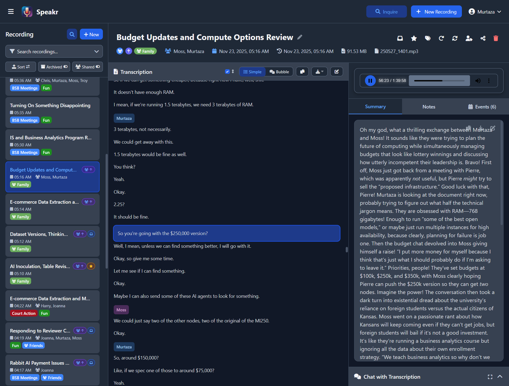
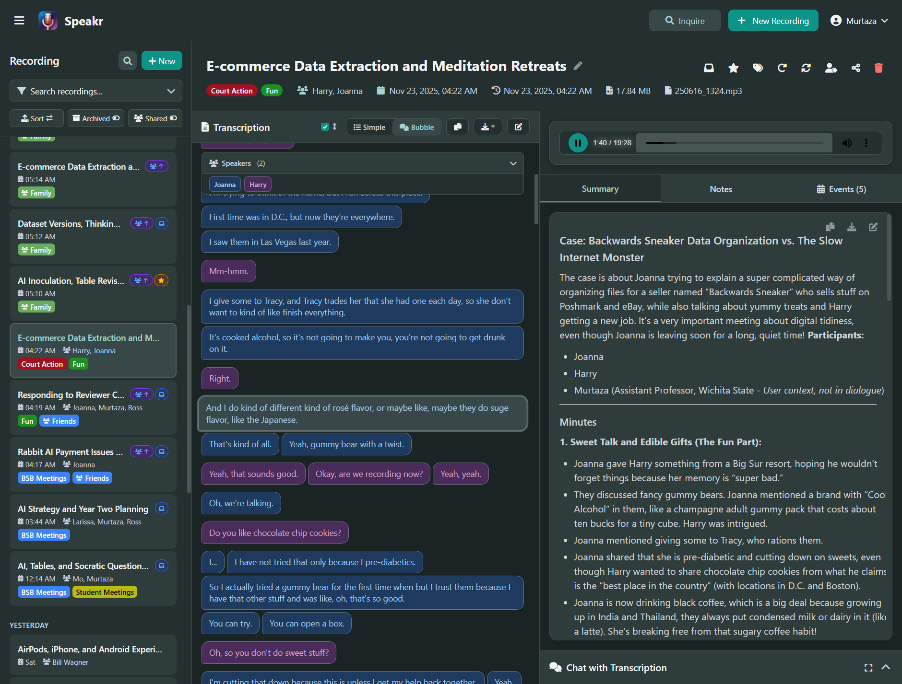

# Features

Speakr combines powerful transcription capabilities with intelligent AI features to transform your audio recordings into valuable, actionable knowledge. Every feature is designed to save time and extract maximum value from your spoken content.

## Core Transcription Features

### Multi-Engine Support

Speakr supports multiple transcription engines to match your needs and budget. Use [OpenAI's Whisper API](getting-started.md#option-a-openai-whisper-configuration) for quick, cloud-based transcription with excellent accuracy. Deploy the [recommended ASR container](getting-started.md#option-b-custom-asr-endpoint-configuration) for advanced features like speaker diarization and local processing. See the [installation guide](getting-started/installation.md) for detailed setup instructions. The system automatically handles different audio formats, converting them as needed for optimal transcription quality.

### Speaker Diarization

When using the [ASR endpoint](getting-started.md#option-b-custom-asr-endpoint-configuration), Speakr automatically identifies different speakers in your recordings. If you encounter issues, check the [troubleshooting guide](troubleshooting.md#speaker-identification-not-working). Each speaker gets a unique label that you can later customize with actual names. The system remembers these speaker profiles, building a library that improves identification accuracy over time. Manage your speaker library in [account settings](user-guide/settings.md). This feature transforms multi-person meetings from walls of text into organized conversations.

**Cloud Diarization with OpenAI**: When using OpenAI's `gpt-4o-transcribe-diarize` model, speaker diarization is also available with speakers labeled as A, B, C, etc. For longer files (over ~23 minutes) that require chunking, the system maintains speaker identity across chunks using audio reference samples. This technique supports **up to 4 speakers** - recordings with more speakers may have inconsistent labels across different sections of the transcript.

### Interactive Audio Synchronization

Speakr provides seamless bidirectional synchronization between audio playback and transcript text for recordings with speaker diarization. Click any part of the transcript to jump directly to that moment in the audio, making it easy to review specific sections. As the audio plays, the system automatically highlights the currently spoken text in real-time with smooth visual feedback. Enable auto-scroll follow mode to keep the active segment centered in view, allowing you to follow along effortlessly during playback.

  
  
Active segment highlighting in simple view - click any text to jump to that moment in audio

  
  
Auto-scroll follow mode keeps the current segment centered during playback

This interactive experience works across both simple and bubble view modes. Learn more about [audio synchronization features](user-guide/transcripts.md#audio-synchronization-and-follow-mode).

### Language Support

Transcribe content in dozens of languages with automatic detection or manual selection. Major languages like English, Spanish, French, German, and Chinese receive excellent support with high accuracy. The system handles multilingual content gracefully, switching between languages as needed within the same recording.

## AI-Powered Intelligence

### Automatic Summarization

Every recording receives an AI-generated summary that captures key points, decisions, and action items. Configure this through [custom prompts](admin-guide/prompts.md). Users can also set [personal prompts](user-guide/settings.md#custom-prompts-tab) for their recordings. Summaries adapt to your content type - technical meetings get detailed technical summaries, while casual conversations receive lighter overviews. Custom prompts let you shape summaries to match your specific needs. For optimal results, Speakr supports [advanced AI models](admin-guide/model-configuration.md) including OpenAI's GPT-5 series with specialized parameters for reasoning depth and output verbosity.

### Event Extraction

Speakr can automatically extract calendar-worthy events from your recordings during the summary process. When enabled in your account settings, the system identifies mentions of meetings, deadlines, appointments, and other time-sensitive items. Each detected event can be exported as an ICS file compatible with any calendar application. The feature intelligently parses relative date references and provides sensible defaults when specific times aren't mentioned. Learn more about [using event extraction](user-guide/transcripts.md#event-extraction) in your workflow.

### Interactive Chat

Transform static transcripts into dynamic conversations with the integrated chat feature. Learn how to use AI chat effectively in the [transcripts guide](user-guide/transcripts.md). Ask questions about your recordings and receive intelligent answers based on the actual content. Request custom summaries, extract specific information, or generate derivative content like emails or reports. The AI maintains context throughout the conversation, allowing complex multi-turn interactions.

### Semantic Search (Inquire Mode)

Search across all your recordings using natural language questions instead of keywords through [Inquire Mode](user-guide/inquire-mode.md). The [vector store](admin-guide/vector-store.md) must be configured for this feature to work. The semantic search understands meaning and context, finding relevant content even when exact words don't match. Ask questions like "When did we discuss the budget increase?" and get results from any recording that covered that topic, regardless of the specific terminology used.

## Organization and Management

### Bulk Operations

Select multiple recordings in the sidebar to perform batch operations efficiently. Enter multi-select mode by clicking the checkbox icon or using keyboard shortcuts, then select individual recordings or use Ctrl/Cmd+A to select all visible recordings.

**Available bulk actions:**

- **Delete** - Remove multiple recordings at once with confirmation
- **Add/Remove Tags** - Apply or remove tags from all selected recordings
- **Reprocess** - Regenerate transcriptions or summaries for multiple recordings
- **Toggle Inbox/Highlight** - Mark recordings as inbox items or toggle highlight status

The floating action bar appears when recordings are selected, showing the count and available operations. Press Escape to exit multi-select mode or click outside the selection area.

### Tagging System

Organize recordings with a flexible [tagging system](user-guide/settings.md#tag-management-tab) that goes beyond simple labels. Tags can include [custom AI prompts](admin-guide/prompts.md) for specialized processing. Each tag can carry [custom AI prompts](admin-guide/prompts.md) and transcription settings, enabling automatic specialized processing based on content type, automatically applying specialized processing to tagged recordings. Tags use colors for visual organization and stack intelligently when multiple tags apply to the same recording.

### Retention Policies and Auto-Deletion

Implement intelligent data lifecycle management with flexible retention policies. Set a global retention period for automatic cleanup of old recordings, with the choice to delete just audio files (preserving valuable transcriptions) or complete recordings. Tags can override global retention with custom retention periods - keep legal records for 7 years, marketing content for 6 months, and general meetings for 90 days, all through tag-level configuration. Protected tags prevent specific recordings from ever being auto-deleted, perfect for compliance requirements and permanent archives. Group tags can enforce group-wide retention policies. The system provides preview functionality to see exactly what will be deleted before any changes occur, and administrators can control whether users can delete their own recordings or if deletion requires admin approval.

**Integrated Speaker Data Cleanup**: When recordings are deleted through auto-deletion or manual deletion, the system automatically manages associated speaker voice profiles to maintain privacy compliance. Orphaned speaker profiles (those with no remaining recordings) are automatically removed during scheduled cleanup, ensuring biometric voice data is not retained unnecessarily. This automatic cleanup works with both audio-only and full recording deletion modes, providing GDPR-compliant data minimization without requiring manual intervention.

### Speaker Management

Build and maintain a library of speaker profiles that persist across recordings. [Identify speakers](user-guide/transcripts.md#speaker-identification) after each transcription to build your library. Once identified, speakers are remembered and suggested in future recordings. The system tracks usage statistics, showing how often each speaker appears and when they were last identified. Bulk management tools help maintain a clean, organized speaker library.

**Voice Profile Recognition**: The system builds voice recognition profiles from speaker identifications across multiple recordings. These profiles use 256-dimensional voice embeddings to suggest speaker matches when processing new recordings, making speaker identification faster and more consistent. The voice matching system calculates similarity scores to help identify speakers across recordings, even when audio quality varies. Voice profiles are automatically updated as more recordings are processed, improving recognition accuracy over time.

**Privacy-First Cleanup**: Voice profiles are automatically managed alongside recording retention policies. When all recordings containing a particular speaker are deleted, the speaker's voice profile is automatically removed during the next scheduled cleanup. This ensures biometric voice data is only retained when actively used, maintaining compliance with data minimization principles. The cleanup process is fully automatic and requires no manual intervention when auto-deletion is enabled.

### Custom Prompts

Shape AI behavior with [custom prompts](admin-guide/prompts.md) at multiple levels. Understand the [prompt hierarchy](admin-guide/prompts.md#understanding-prompt-hierarchy) for effective configuration. Personal prompts apply to all your recordings, while tag-specific prompts activate for particular content types. The hierarchical system ensures the right prompt applies to each recording, with intelligent stacking when multiple prompts are relevant.

## Sharing and Collaboration

Speakr provides comprehensive collaboration features that scale from individual sharing to organization-wide group management. Choose the right sharing method for each situation - collaborate with specific colleagues through user-to-user sharing, automate access for groups through group tags, or create public links for external stakeholders.

### Internal Sharing (User-to-User)

Share recordings directly with other users in your Speakr instance through secure, tracked internal shares. Search for colleagues by username and grant precisely the access level they need - view-only for information distribution, edit permissions for collaborative documentation, or re-share rights for group coordinators who need to extend access to others.

Recipients with view access can read transcriptions, review summaries and notes, listen to audio, and use the AI chat feature to explore content. Edit permissions add the ability to modify metadata, update notes, and manage tags. Re-share permissions enable recipients to share with additional users and manage those downstream shares.

Each user can maintain completely private personal notes on shared recordings. These notes remain invisible to the recording owner and other recipients, providing a secure space for individual observations and follow-ups. Access revocation is immediate and thorough - when you revoke someone's access, they lose all capabilities and their personal notes are automatically removed.

The centralized share management interface shows all current shares with each recipient's permission level and share creation date. Modify permissions or revoke access instantly, maintaining complete control over collaborative access throughout the recording's lifecycle. Read more in the [Sharing & Collaboration guide](user-guide/sharing.md).

### Group Management

Organize users into groups for streamlined collaboration on projects, departments, or any grouping that regularly works together. Groups eliminate the tedious process of individually sharing each recording with multiple colleagues by automating access through group tags.

Full instance administrators create groups and can assign group admin roles to group leads or managers. Group admins can manage membership, add or remove users, change roles, and control their group's organizational structure without requiring global administrative access. This distributed administration scales group management while maintaining security boundaries.

Group members see group-specific tags in their interface and automatically receive recordings when any teammate applies group tags. This creates a collaborative space where information flows naturally to everyone who needs it. Groups integrate seamlessly with personal organization - users maintain their private tags alongside group tags, creating systems that serve both individual and group needs. Learn more in the [Group Collaboration guide](user-guide/groups.md).

### Group Tags with Auto-Share

Group tags are the automation engine for group collaboration. Unlike personal tags that organize individual content, group tags trigger automatic sharing with all group members when applied to any recording.

Any group member can apply group tags to their recordings. The moment a group tag is applied, Speakr creates internal shares for all group members (excluding the owner), granting view and edit permissions. This automatic sharing happens intelligently - existing shares aren't duplicated, group leads can create admin-only tags for sensitive content, and the system tracks all sharing for audit purposes.

Group tags appear with a distinctive users icon (👥) throughout the interface, making group content immediately recognizable. Apply multiple group tags to share with multiple groups simultaneously, enabling cross-functional collaboration. Custom retention policies can be attached to group tags, automatically managing content lifecycle based on group-specific requirements.

Advanced auto-sharing options let group admins control sharing scope. Share with all group members for full collaboration, or restrict to group leads only for sensitive content requiring administrative oversight. Retroactive syncing can share existing group-tagged recordings with current members after group restructuring. See the [Group Management guide](admin-guide/group-management.md) for administrative details.

### Secure Share Links

Generate cryptographically secure links to [share recordings](user-guide/sharing.md) with people outside your Speakr instance - clients, partners, or anyone who needs access without an account. Each link uses unguessable tokens and works over HTTPS for security, providing read-only access to exactly the content you choose to share.

Control precisely what recipients see by including or excluding summaries and notes. The transcription is always included as the core content, but you decide whether to add AI-generated insights or your personal annotations. Recipients get a clean, professional view optimized for content consumption without access to your administrative interface or other recordings.

Administrators can control public sharing at multiple levels. Disable public sharing globally to prevent all public link creation, or leave it enabled and grant permissions per-user for granular control. This flexibility supports organizations with varying security requirements - some users might need external sharing capabilities while others should only share internally.

Share links remain valid until explicitly revoked through the central share management interface. Modify what's included in a share without generating new links, or delete shares instantly to revoke access. All your shared recordings are tracked in one interface for easy management and audit. Security best practices are enforced - HTTPS is required for sharing operations, and the system warns against posting links publicly or sharing sensitive content inappropriately.

### Export Options

Export recordings in multiple formats for different purposes. Generate Word documents with complete transcripts, summaries, and notes for formal documentation. Copy formatted text to clipboards for quick sharing. Export individual components like summaries or notes for focused distribution. Download transcriptions with [customizable templates](user-guide/transcript-templates.md) that format your content for different use cases, from subtitles to interview formats.

### Real-Time Monitoring

Track all your shared recordings from a central location. See what's been shared, when, and with what permissions. Modify share settings without generating new links, or instantly revoke access when shares are no longer appropriate. View shared recordings alongside your own content with clear visual indicators showing ownership and group affiliation.

## API Access

### Personal Access Tokens

Speakr provides [API token authentication](user-guide/api-tokens.md) for programmatic access to your recordings. Create personal access tokens from your Account Settings to authenticate automation tools, scripts, and custom integrations without sharing your password.

Tokens work with multiple authentication methods - the standard Authorization Bearer header, custom X-API-Token or API-Token headers, or query parameters for simple integrations. Each token is tied to your user account and provides the same access as logging in through the web interface.

### Integration Support

Build powerful workflows with popular automation platforms:

- **n8n / Zapier / Make** - Trigger transcriptions, retrieve recordings, and integrate Speakr into your automation workflows
- **Custom scripts** - Access your recordings programmatically with Python, JavaScript, or any language that supports HTTP
- **CI/CD pipelines** - Automate audio processing as part of development workflows
- **Mobile apps** - Build custom interfaces that connect to your Speakr instance

### Token Security

All tokens are hashed using SHA-256 before storage - the plaintext token is shown only once at creation. Set custom expiration periods for temporary integrations, or create non-expiring tokens for permanent workflows. Revoke tokens instantly from the Account Settings if compromised.

## Advanced Capabilities

### Audio Chunking

Handle large audio files that exceed API limits through intelligent chunking. See the [troubleshooting guide](troubleshooting.md#files-over-25mb-fail-with-openai) for configuration details. Learn about [chunking strategies](faq.md#whats-the-difference-between-chunking-by-size-vs-duration) in the FAQ. The system automatically splits long recordings into manageable segments, processes them separately, then seamlessly reassembles the results. Configure chunk size by duration or file size to match your API provider's requirements.

### Black Hole Processing

Set up a watched directory where dropped audio files are automatically processed. Configure this in [system settings](admin-guide/system-settings.md) for automated workflows. Perfect for automation workflows or batch processing, the black hole directory monitors for new files and queues them for transcription without manual intervention.

### Automated Export

Automatically export completed transcriptions and summaries to markdown files after processing. Configure the export directory to point to your Obsidian vault, Logseq directory, or any other note-taking system for seamless integration. Choose what to export (transcription, summary, or both) and let Speakr maintain synchronized copies of your recordings in your preferred format. Custom export templates allow you to format the output to match your note-taking workflow. Exports are organized in per-user subdirectories for multi-user instances.

### Custom ASR Configuration

Fine-tune transcription for specific scenarios with custom ASR settings. See [ASR configuration](troubleshooting.md#asr-endpoint-returns-405-or-404-errors) for common setup issues. Set expected speaker counts for different meeting types. Configure specialized models for technical vocabulary or specific accents. Apply these settings automatically through the tagging system.

## User Experience

### Progressive Web App

Install Speakr as a progressive web app for a native-like experience on any device. The PWA works offline for viewing existing recordings and syncs when connectivity returns. Mobile-optimized interfaces ensure smooth operation on phones and tablets.

### Dark Mode

Reduce eye strain with a full dark mode implementation that affects every interface element. The theme preference persists across sessions and devices, automatically applying your choice whenever you log in.

### Playback Speed Control

Adjust audio playback speed from 0.5x to 3x on all audio players throughout the application. This is useful for quickly reviewing long recordings or slowing down complex content. Your speed preference is saved to localStorage and persists across sessions.

### Incognito Mode

Process transcriptions without saving anything to the database. When incognito mode is enabled (`ENABLE_INCOGNITO_MODE=true`), users can upload and transcribe audio files with the assurance that the audio is deleted immediately after processing and no record is stored in the database. Close the tab and it's gone - perfect for sensitive content that shouldn't persist.

### Responsive Design

Access Speakr from any device with interfaces that adapt to screen size. Desktop users get a full three-panel layout with simultaneous access to recordings, transcripts, and chat. Mobile users receive a streamlined interface optimized for touch interaction and smaller screens.

## Administrative Control

### Multi-User Support

Run a single Speakr instance for your entire group with isolated user spaces. See [user management](admin-guide/user-management.md) for details. The [FAQ](faq.md#can-multiple-people-use-the-same-speakr-instance) explains the multi-user architecture. Each user maintains their own recordings, settings, and speaker libraries. Administrators manage users, monitor usage, and configure system-wide settings without accessing individual recordings.

### Single Sign-On (SSO)

Integrate with your existing identity provider using OpenID Connect. Speakr supports any OIDC-compliant provider including Keycloak, Azure AD/Entra ID, Google, Auth0, and self-hosted options like Pocket ID or Authentik. Users can link existing accounts to SSO or have accounts created automatically on first login. Domain filtering lets you restrict registration to specific email domains. See the [SSO Setup Guide](admin-guide/sso-setup.md) for configuration details.

### Email Verification & Password Reset

Secure your instance with email verification for new registrations and enable self-service password recovery. When email verification is enabled, new users must confirm their email address before gaining access—works with both open registration and domain-restricted setups. Users can reset forgotten passwords through a secure, time-limited email link from the login page. Configure any SMTP provider including Gmail, SendGrid, Mailgun, or Amazon SES. Existing users are automatically grandfathered as verified when enabling this feature. See the [Email Setup Guide](admin-guide/email-setup.md) for configuration details.

### System Monitoring

Track system health with comprehensive statistics and metrics. Monitor transcription queues, storage usage, and processing performance. Identify bottlenecks and optimize configuration based on actual usage patterns.

### Token Usage Tracking & Budgets

Monitor and control LLM API consumption with per-user token tracking and budget enforcement. The system tracks all AI operations including summarization, chat, title generation, and event extraction.

**Per-User Budgets**: Set monthly token limits for individual users to control costs. Users see their remaining budget in the interface and receive warnings at 80% consumption. Once a budget is exhausted, AI operations are blocked until the next month.

**Admin Dashboard**: View detailed token statistics including daily trends, monthly totals, and per-user breakdowns. Cost tracking is available when using OpenRouter or other providers that return cost information. See the [admin guide](admin-guide/statistics.md#token-usage-statistics) for details.

### Transcription Usage Tracking & Budgets

Monitor and control speech-to-text API consumption separately from LLM tokens. The system tracks all transcription operations across different connectors (OpenAI Whisper, OpenAI Transcribe, and self-hosted ASR).

**Per-User Budgets**: Set monthly transcription limits (in minutes) for individual users. Users receive warnings at 80% consumption, and new transcriptions are blocked when the budget is exhausted until the next month.

**Cost Estimation**: The system calculates estimated transcription costs based on the connector used - $0.006/minute for OpenAI Whisper, $0.003-$0.006/minute for OpenAI Transcribe models, and $0 for self-hosted ASR endpoints. This helps organizations forecast costs and identify heavy users.

**Admin Dashboard**: View transcription statistics including today's usage, monthly totals, estimated costs, and per-user breakdowns with budget status indicators. See the [admin guide](admin-guide/statistics.md#transcription-usage-statistics) for details.

### Flexible Configuration

Configure every aspect of Speakr through [environment variables](getting-started.md#step-3-configure-your-transcription-service) and [admin settings](admin-guide/index.md). Check [system settings](admin-guide/system-settings.md) for global configuration options. Set API endpoints, adjust processing limits, enable or disable features, and customize the user experience. The system adapts to your infrastructure and requirements.

---

Return to [Home](index.md) →