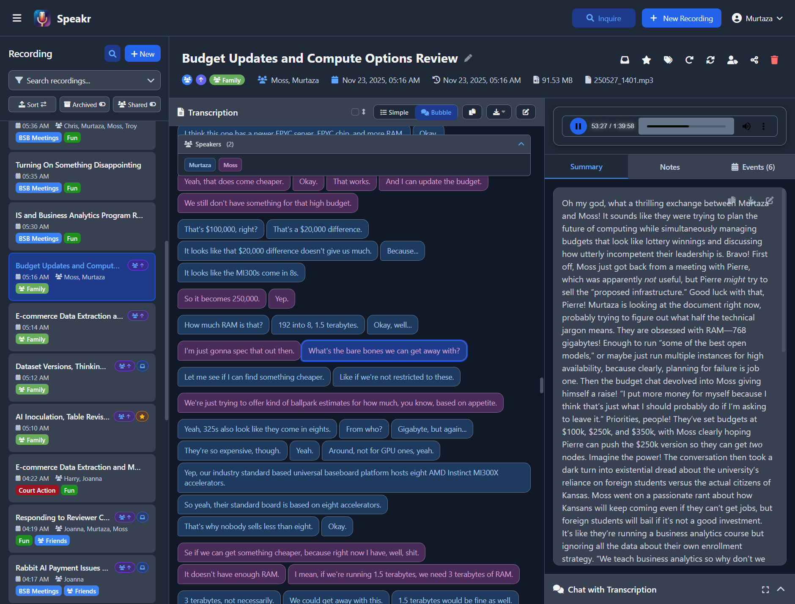

# Welcome to Speakr

Speakr is a powerful self-hosted transcription platform that helps you capture, transcribe, and understand your audio content. Whether you're recording meetings, interviews, lectures, or personal notes, Speakr transforms spoken words into valuable, searchable knowledge.

<div style="max-width: 80%; margin: 2em auto;">
  
</div>

!!! info "Latest Release: v0.8.6 - Folders & Automation"
    **Organize recordings into folders with custom prompts, auto speaker labeling, and per-user auto-summarization**

    - **Folders Organization** - Group recordings into folders with custom prompts and ASR settings per folder
    - **Auto Speaker Labeling** - Automatic speaker identification using voice embedding matching
    - **Per-User Auto-Summarization** - User-configurable automatic summary generation
    - **Azure OpenAI Connector** - Experimental transcription connector (community testing welcome)

    See the [v0.8.0 release notes](#version-080) for the full connector architecture and REST API features.

## Quick Navigation

<div class="grid cards">
  <div class="card">
    <div class="card-icon">📚</div>
    <h3>Getting Started</h3>
    <p>New to Speakr? Start here for a quick overview and setup guide.</p>
    <a href="getting-started" class="card-link">Get Started →</a>
  </div>
  
  <div class="card">
    <div class="card-icon">🚀</div>
    <h3>Installation</h3>
    <p>Step-by-step instructions for Docker and manual installation.</p>
    <a href="getting-started/installation" class="card-link">Install Now →</a>
  </div>
  
  <div class="card">
    <div class="card-icon">👤</div>
    <h3>User Guide</h3>
    <p>Learn how to <a href="user-guide/recording">record</a>, <a href="user-guide/transcripts">transcribe</a>, and manage your audio content.</p>
    <a href="user-guide/" class="card-link">Learn More →</a>
  </div>
  
  <div class="card">
    <div class="card-icon">⚙️</div>
    <h3>Admin Guide</h3>
    <p>Configure <a href="admin-guide/user-management">users</a>, <a href="admin-guide/prompts">system settings</a>, and manage your instance.</p>
    <a href="admin-guide/" class="card-link">Configure →</a>
  </div>
  
  <div class="card">
    <div class="card-icon">❓</div>
    <h3>FAQ</h3>
    <p>Find answers to commonly asked questions about Speakr.</p>
    <a href="faq" class="card-link">View FAQ →</a>
  </div>
  
  <div class="card">
    <div class="card-icon">🔧</div>
    <h3>Troubleshooting</h3>
    <p>Solutions for <a href="troubleshooting#transcription-problems">transcription issues</a> and <a href="troubleshooting#performance-issues">performance problems</a>.</p>
    <a href="troubleshooting" class="card-link">Get Help →</a>
  </div>
</div>

## Core Features

<div class="feature-grid">
  <div class="feature-card">
    <h4>🎙️ Smart Recording</h4>
    <ul>
      <li>Audio capture from mic or system</li>
      <li>Take notes while recording</li>
      <li>Generate <a href="features#automatic-summarization">smart summaries</a></li>
    </ul>
  </div>
  
  <div class="feature-card">
    <h4>🤖 AI Transcription</h4>
    <ul>
      <li><a href="features#language-support">Multi-language support</a></li>
      <li><a href="features#speaker-diarization">Speaker identification</a></li>
      <li><a href="features#speaker-management">Voice profiles with AI recognition</a></li>
      <li>Custom vocabularies</li>
    </ul>
  </div>
  
  <div class="feature-card">
    <h4>🔍 Intelligent Search</h4>
    <ul>
      <li><a href="user-guide/inquire-mode">Semantic search</a></li>
      <li>Natural language queries</li>
      <li>Cross-recording search</li>
    </ul>
  </div>
  
  <div class="feature-card">
    <h4>📊 Organization</h4>
    <ul>
      <li><a href="features#tagging-system">Smart tagging system</a></li>
      <li><a href="admin-guide/prompts">Custom AI prompts with stacking</a></li>
      <li><a href="features#speaker-management">Speaker voice profiles with auto-cleanup</a></li>
    </ul>
  </div>
  
  <div class="feature-card">
    <h4>🌍 International</h4>
    <ul>
      <li>5+ languages supported</li>
      <li>Automatic UI translation</li>
      <li>Localized summaries</li>
    </ul>
  </div>
  
  <div class="feature-card">
    <h4>🔒 Privacy First</h4>
    <ul>
      <li><a href="getting-started/installation">Self-hosting ready</a></li>
      <li><a href="troubleshooting#offline-deployment">Offline-ready</a></li>
      <li><a href="user-guide/sharing">Secure sharing</a></li>
    </ul>
  </div>

  <div class="feature-card">
    <h4>🔑 REST API</h4>
    <ul>
      <li><a href="user-guide/api-reference">Full REST API v1</a></li>
      <li><a href="user-guide/api-tokens">Personal access tokens</a></li>
      <li>Interactive <a href="user-guide/api-reference#openapi-specification">Swagger UI docs</a></li>
      <li>n8n, Zapier, Make integration</li>
    </ul>
  </div>
</div>

## Interactive Audio Synchronization

Experience seamless bidirectional synchronization between your audio and transcript. Click any part of the transcript to jump directly to that moment in the audio, or watch as the system automatically highlights the currently spoken text as the audio plays. Enable auto-scroll follow mode to keep the active segment centered in view, creating an effortless reading experience for even the longest recordings.

<div style="max-width: 90%; margin: 2em auto;">
  
  <p style="text-align: center; margin-top: 0.5rem; font-style: italic; color: #666;">Real-time transcript highlighting synchronized with audio playback, with auto-scroll follow mode</p>
</div>

Learn more about [audio synchronization features](user-guide/transcripts.md#audio-synchronization-and-follow-mode) in the user guide.

!!! tip "Transform Your Recordings with Custom Tag Prompts"
    Tags aren't just for organization - they transform content. Create a "Recipe" tag to convert cooking narration into formatted recipes. Use "Study Notes" tags to turn lecture recordings into organized outlines. Stack tags like "Client Meeting" + "Legal Review" for combined analysis. Learn more in the [Custom Prompts guide](admin-guide/prompts.md#creative-tag-prompt-use-cases).

## Latest Updates

!!! info "Version 0.8.7 - Export Templates & Localization"
    - **Customizable Export Templates** - Create markdown templates for exports with variables (`{{title}}`, `{{summary}}`, `{{notes}}`) and conditionals for optional sections
    - **Localized Labels** - Use `{{label.metadata}}`, `{{label.summary}}` etc. for automatically translated labels based on user's UI language
    - **Localized Dates** - Export dates formatted per user's language preference (e.g., "15. Januar 2026" for German)
    - **Improvements** - Opt-in ASR chunking, speaker ID remapping, ASR validation fixes

    Fully backwards compatible with v0.8.x.

!!! info "Version 0.8.3 - Naming Templates"
    - **Custom Title Formatting** - Create templates with variables (`{{ai_title}}`, `{{filename}}`, `{{date}}`) and regex patterns to extract data from filenames
    - **Tag or User Default** - Assign templates to tags or set a user-wide default; templates without `{{ai_title}}` skip the AI call to save tokens
    - **API v1 Upload** - New `/api/v1/upload` endpoint for programmatic recording uploads
    - **Improvements** - Tag drag-and-drop reordering, registration domain restriction, event delete button, WebM seeking fix

    Fully backwards compatible with v0.8.x.

!!! info "Version 0.8.2 - Transcription Usage Tracking"
    - **Transcription Budget Management** - Set monthly transcription limits (in minutes) per user with 80% warnings and 100% blocking
    - **Usage Statistics** - Track transcription minutes and estimated costs across all connectors
    - **Admin Dashboard Improvements** - Redesigned stats layout with summary cards and per-user tables

!!! info "Version 0.8.0 - Connector Architecture & REST API"
    - **Connector-Based Transcription** - Modular architecture with auto-detection for transcription providers
    - **OpenAI Diarization** - Use `gpt-4o-transcribe-diarize` for speaker identification without self-hosting
    - **REST API v1** - Complete API for automation tools with Swagger UI at `/api/v1/docs`

    See the [Migration Guide](admin-guide/migration-guide.md) and [API Reference](user-guide/api-reference.md).

!!! warning "PyTorch 2.6 Compatibility Issue with WhisperX ASR"
    If you're using the WhisperX ASR service and encounter a "Weights only load failed" error after a recent update, add this environment variable to your ASR container in docker-compose.yml:
    ```yaml
    environment:
      - TORCH_FORCE_NO_WEIGHTS_ONLY_LOAD=true
    ```
    This is caused by a PyTorch 2.6 change. See [troubleshooting](troubleshooting.md#pytorch-26-weights-loading-error-whisperx-asr-service) for details.

!!! info "Version 0.6.6 - Filter & Compress"
    **New Features** - Audio compression and enhanced filtering

    - **Auto Compression** - Lossless uploads automatically compressed (configurable codec/bitrate)
    - **Speaker Filtering** - Filter recordings by speaker, starred/inbox toggles
    - **Sorting Fix** - Sort toggle works correctly, added Upcoming group for future dates
    - **Format Support** - .weba format, FFmpeg fallback for unknown formats

    ✅ Fully backward compatible. Optional env vars: `AUDIO_COMPRESS_UPLOADS`, `AUDIO_CODEC`, `AUDIO_BITRATE`

!!! info "Version 0.6.5 - Separate Chat Model Configuration"
    **New Feature** - Configure different AI models for chat vs background tasks

    - **Separate Chat Model** - Use different service tiers for chat and summarization (#143)
    - **Custom Datetime Picker** - New themed calendar and time selection modal
    - **Bug Fixes** - Audio chunking after refactor (#140), username display (#138)

    ✅ Fully backward compatible. Optional `CHAT_MODEL_*` environment variables.

!!! success "Version 0.6.3 - API Token Authentication"
    **New Feature** - Programmatic API access for automation tools

    - **API Tokens** - Create personal access tokens for programmatic API access
    - **Multiple Auth Methods** - Bearer token, X-API-Token header, API-Token header, or query parameter
    - **Token Management** - Create, revoke, and track token usage from Account Settings
    - **Flexible Expiration** - Set custom expiration periods or create non-expiring tokens
    - **Secure Storage** - Tokens are hashed (SHA-256) and never stored in plaintext

    ✅ Fully backward compatible with v0.6.x. No configuration changes required.

!!! success "Version 0.6.2 - UX Polish & Bug Fixes"
    - Standardized modal UX with backdrop click and consistent X button placement
    - Recording disclaimer markdown support
    - IndexedDB crash recovery fixes
    - Processing queue cleanup on delete

!!! success "Version 0.6.1 - Offline Ready"
    - **HuggingFace Model Caching** - Embedding model persists across container restarts
    - **Offline Deployment** - Run once with internet, then works fully offline

!!! success "Version 0.6.0 - Queue Control"
    - **Multi-User Job Queue** - Fair round-robin scheduling with automatic retry for failed jobs
    - **Unified Progress Tracking** - Single view merging uploads and backend processing
    - **Media Support** - Added video format support and fixed Firefox system audio recording

!!! warning "Version 0.5.9 - Major Release"
    **⚠️ Major architectural changes** - Backup data before upgrading!

    - **Internal Sharing System** - Share recordings with granular permissions (view/edit/reshare)
    - **Group Management** - Create groups with leads, group tags, custom retention policies
    - **Speaker Voice Profiles** - AI-powered recognition with embeddings (requires WhisperX)
    - **Audio-Transcript Sync** - Click-to-jump, auto-highlight, and follow mode
    - **Auto-Deletion & Retention** - Global and group-level policies with tag protection
    - **Modular Architecture** - Backend refactored into blueprints, frontend composables

    Previous release (v0.5.8):

    - **Inline Transcript Editing** - Edit speaker assignments and text directly in the speaker identification modal
    - **Add Speaker Functionality** - Dynamically add new speakers during transcript review
    - **Enhanced Speaker Modal** - Improved UX with hover-based edit controls and real-time updates

    Previous release (v0.5.7):

    - **GPT-5 Support** - Full support for OpenAI's GPT-5 model family with automatic parameter detection
    - **Custom Summary Prompts on Reprocessing** - Experiment with different prompts when regenerating summaries
    - **PWA Enhancements** - Service worker for wake lock to prevent screen sleep on mobile

    Previous release (v0.5.6):

    - Event extraction for automatically identifying calendar-worthy events
    - Transcript templates for customizable download formats
    - Enhanced export options and improved mobile UI

## Getting Help

Need assistance? We're here to help:

<div class="help-grid">
  <div class="help-card">
    <h4>📖 Documentation</h4>
    <p>You're already here! Browse our comprehensive guides:</p>
    <ul>
      <li><a href="faq">Frequently Asked Questions</a></li>
      <li><a href="troubleshooting">Troubleshooting Guide</a></li>
      <li><a href="user-guide/">User Documentation</a></li>
      <li><a href="admin-guide/">Admin Documentation</a></li>
    </ul>
  </div>
  
  <div class="help-card">
    <h4>💬 Community</h4>
    <p>Connect with other users and get support:</p>
    <ul>
      <li><a href="https://github.com/murtaza-nasir/speakr/issues">Report Issues</a></li>
      <li><a href="https://github.com/murtaza-nasir/speakr/discussions">Join Discussions</a></li>
      <li><a href="https://github.com/murtaza-nasir/speakr">Star on GitHub</a></li>
    </ul>
  </div>
</div>

---

Ready to transform your audio into actionable insights? [Get started now](getting-started.md) →