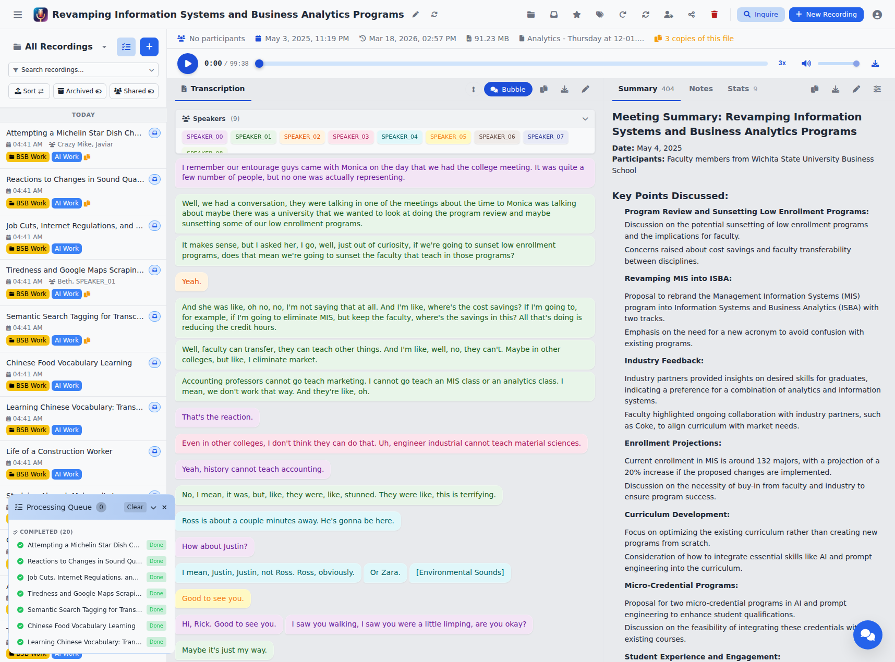

# Welcome to Speakr

Speakr is a powerful self-hosted transcription platform that helps you capture, transcribe, and understand your audio content. Whether you're recording meetings, interviews, lectures, or personal notes, Speakr transforms spoken words into valuable, searchable knowledge.

  

!!! success "Latest Release: v0.9.0 — Multi-platform recording, Stats tab, mobile rebuild, design-system unification"
    The first non-patch release in the v0.8 line. Three big user-facing themes: capturing audio is now multi-platform with a per-OS help guide and a Web Audio mixing path for capturing both sides of a meeting; a new Stats tab shows per-recording metrics; the mobile detail view is a first-class member of the design system. Upload modal redesigned, inquire mode polished, dark-mode select dropdowns finally legible.

    See the [full release notes](https://github.com/murtaza-nasir/speakr/blob/master/release_notes_v0.9.0.md) for the complete list. Backwards compatible with v0.8.x; database migrations run automatically.

## Quick Navigation

  

    <h3>Getting Started</h3>
    
New to Speakr? Start here for a quick overview and setup guide.

    <a href="getting-started" class="card-link">Get Started →</a>
  

  
  

    <h3>Installation</h3>
    
Step-by-step instructions for Docker and manual installation.

    <a href="getting-started/installation" class="card-link">Install Now →</a>
  

  
  

    <h3>User Guide</h3>
    
Learn how to <a href="user-guide/recording">record</a>, <a href="user-guide/transcripts">transcribe</a>, and manage your audio content.

    <a href="user-guide/" class="card-link">Learn More →</a>
  

  
  

    <h3>Admin Guide</h3>
    
Configure <a href="admin-guide/user-management">users</a>, <a href="admin-guide/prompts">system settings</a>, and manage your instance.

    <a href="admin-guide/" class="card-link">Configure →</a>
  

  
  

    <h3>FAQ</h3>
    
Find answers to commonly asked questions about Speakr.

    <a href="faq" class="card-link">View FAQ →</a>
  

  
  

    <h3>Troubleshooting</h3>
    
Solutions for <a href="troubleshooting#transcription-problems">transcription issues</a> and <a href="troubleshooting#performance-issues">performance problems</a>.

    <a href="troubleshooting" class="card-link">Get Help →</a>
  

## Core Features

Speakr takes a recording from raw audio to organized, searchable, shareable knowledge. The pipeline:

  

    <h4>Capture</h4>
    <ul>
      <li><a href="user-guide/recording">Mic, system/tab audio, or both mixed</a></li>
      <li>Hours-long server-side recording sessions</li>
      <li>Drag-and-drop upload and black-hole auto-import</li>
    </ul>
  

  

    <h4>Transcribe</h4>
    <ul>
      <li><a href="features#multi-engine-support">Bring your own engine: WhisperX, OpenAI, Mistral, custom ASR</a></li>
      <li><a href="features#speaker-diarization">Speaker diarization</a> and <a href="features#speaker-management">voice profiles</a> (WhisperX backend)</li>
      <li><a href="features#language-support">Auto-detect plus 11 common languages</a> with custom vocabulary hints</li>
    </ul>
  

  

    <h4>Understand</h4>
    <ul>
      <li><a href="features#automatic-summarization">Customizable AI summaries</a></li>
      <li>Event extraction and per-recording chat</li>
      <li><a href="user-guide/inquire-mode">Inquire Mode: semantic search across everything</a></li>
    </ul>
  

  

    <h4>Organize</h4>
    <ul>
      <li><a href="features#tagging-system">Smart tags with custom prompts, stackable</a></li>
      <li>Folders and bulk operations</li>
      <li><a href="features#retention-policies-and-auto-deletion">Retention policies and auto-deletion</a></li>
    </ul>
  

  

    <h4>Collaborate</h4>
    <ul>
      <li><a href="user-guide/sharing">Granular internal sharing and public links</a></li>
      <li>Groups with auto-share group tags</li>
      <li><a href="features#single-sign-on-sso">Multi-user with Single Sign-On (OIDC)</a></li>
    </ul>
  

  

    <h4>Automate</h4>
    <ul>
      <li><a href="user-guide/api-reference">REST API v1 with Swagger UI</a></li>
      <li><a href="features#webhooks">Signed webhooks</a> on lifecycle events</li>
      <li>n8n, Zapier, Make integration</li>
    </ul>
  

## Interactive Audio Synchronization

Experience seamless bidirectional synchronization between your audio and transcript. Click any part of the transcript to jump directly to that moment in the audio, or watch as the system automatically highlights the currently spoken text as the audio plays. Enable auto-scroll follow mode to keep the active segment centered in view, creating an effortless reading experience for even the longest recordings.

  
  
Real-time transcript highlighting synchronized with audio playback, with auto-scroll follow mode

Learn more about [audio synchronization features](user-guide/transcripts.md#audio-synchronization-and-follow-mode) in the user guide.

!!! tip "Transform Your Recordings with Custom Tag Prompts"
    Tags aren't just for organization - they transform content. Create a "Recipe" tag to convert cooking narration into formatted recipes. Use "Study Notes" tags to turn lecture recordings into organized outlines. Stack tags like "Client Meeting" + "Legal Review" for combined analysis. Learn more in the [Custom Prompts guide](admin-guide/prompts.md#creative-tag-prompt-use-cases).

## Latest Updates

!!! info "Version 0.9.0 - Multi-platform recording, Stats tab, mobile rebuild, design-system unification"
    The first non-patch release in the v0.8 line. Three big user-facing themes: capturing audio is now multi-platform, the mobile app is a first-class member of the design system, and the upload modal stops feeling like a desktop card pasted onto a phone. Backwards compatible with v0.8.x; database migrations run automatically.

    - **System Audio & Multi-Input Recording** - Platform detection with a per-OS help guide (macOS BlackHole + Multi-Output Device, Windows "Share system audio", Linux pavucontrol + `pactl module-virtual-source`). New Input devices picker mixes a primary mic plus an optional secondary device via Web Audio into one track, with a toggle to disable Chrome's echo cancellation / noise suppression / auto-gain and virtual-audio-device discovery.
    - **Stats Tab** - New per-recording tab: total length, speaker count, turns, and words as headline cards; per-speaker time / % / turns / words / WPM breakdown; silence row. Available on desktop and mobile.
    - **Upload Modal Redesign** - Real modal overlay (not a full-screen takeover), progressive disclosure of Options behind a chip summary, inline file preview with duration probe, sticky-footer Upload action, last-used tag / folder / language auto-restore, and a mobile bottom-sheet with drag-to-dismiss.
    - **Mobile UI Rebuild** - 56 px bottom navigation, contextual icons in the chevron row, edge-to-edge content, sticky speaker pills, sticky editor Cancel / Save footer, and audio-player polish.
    - **PWA Web Share Target** - Pick Speakr from your phone's native share sheet to send a recording straight in.
    - **Webhooks** - HMAC-SHA256-signed outbound notifications on recording lifecycle events, with SSRF guard and exponential-backoff retries, managed per-user from Account settings → Webhooks.
    - **Server-side recording sessions** - Long recordings stream chunks to the server during capture; the size cap is replaced by a configurable hours-based ceiling with resume-on-reload.
    - **Design-system unification** - 22 modals on shared `.modal-*` primitives, `.btn` + `.field` everywhere, dark-mode `<select>` theming, header consolidation, sidebar redesign, floating dockable chat panel.
    - **Inquire mode** - "+ New Recording" opens the upload modal directly via `?upload=1`. Also: `GET /api/v1/users/me`, an audio-player position preference, and a localization refresh across all seven languages.

    See the [full release notes](https://github.com/murtaza-nasir/speakr/blob/master/release_notes_v0.9.0.md) for the complete list.

!!! info "Version 0.8.21-alpha - Security: CSRF bypass and SSO account takeover"
    Security patch release on top of v0.8.20-alpha. Tracked as a GitHub Security Advisory; reported by **@Irench1k**.

    - Fixed a CSRF bypass where the `csrf_exempt_for_api_tokens` before_request hook permanently disabled CSRF protection on the targeted view as soon as any request carried a `?token=` query parameter (CWE-287). The hook is gone; CSRF skipping is now a per-request decision driven by `load_user_from_token_headers_only()`.
    - `change_password` no longer silently sets a password on an SSO-only account, closing the chained account-takeover path.

!!! note "Earlier releases"
    The full version history (the rest of the v0.8.x line and the v0.5 to v0.7 releases) is on the [GitHub Releases page](https://github.com/murtaza-nasir/speakr/releases).

## Getting Help

Need assistance? We're here to help:

  

    <h4>Documentation</h4>
    
You're already here! Browse our comprehensive guides:

    <ul>
      <li><a href="faq">Frequently Asked Questions</a></li>
      <li><a href="troubleshooting">Troubleshooting Guide</a></li>
      <li><a href="user-guide/">User Documentation</a></li>
      <li><a href="admin-guide/">Admin Documentation</a></li>
    </ul>
  

  
  

    <h4>Community</h4>
    
Connect with other users and get support:

    <ul>
      <li><a href="https://github.com/murtaza-nasir/speakr/issues">Report Issues</a></li>
      <li><a href="https://github.com/murtaza-nasir/speakr/discussions">Join Discussions</a></li>
      <li><a href="https://github.com/murtaza-nasir/speakr">Star on GitHub</a></li>
    </ul>
  

---

Ready to transform your audio into actionable insights? [Get started now](getting-started.md) →