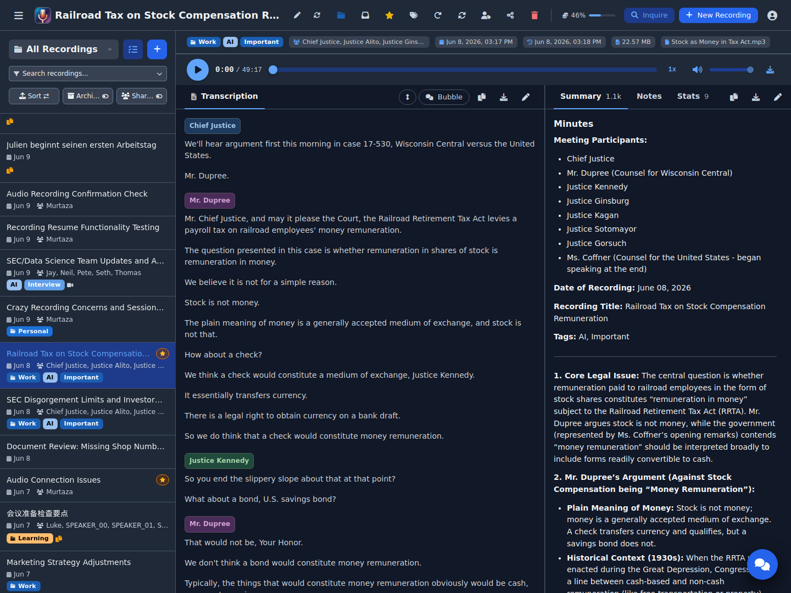
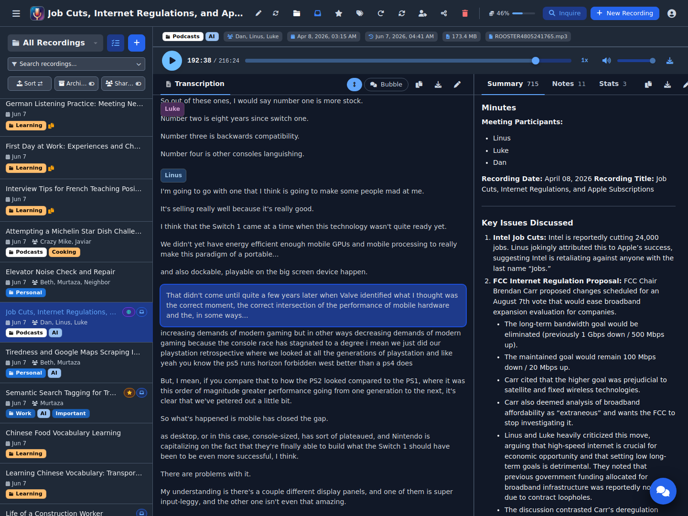

# Welcome to Speakr

Speakr is a powerful self-hosted transcription platform that helps you capture, transcribe, and understand your audio content. Whether you're recording meetings, interviews, lectures, or personal notes, Speakr transforms spoken words into valuable, searchable knowledge.

  

!!! success "Latest Release: v0.10.2-alpha — security fixes, Flask 3.1, and new features (recommended for all deployments)"
    Resolves three coordinated security reports (stored XSS via tag color, webhook SSRF via DNS rebinding, and SSO account takeover via an unverified email claim) and moves to Flask 3.1 / Werkzeug 3.1, closing two Werkzeug denial-of-service issues. Adds contextual speaker labelling for engines without voice embeddings and pause/resume for in-app recording.

    **Action required for some SSO setups:** verified-email enforcement is now on by default. If your identity provider does not send an `email_verified` claim, set `SSO_REQUIRE_VERIFIED_EMAIL=false` before upgrading. All other deployments need no configuration change.

    See the [full release notes](https://github.com/murtaza-nasir/speakr/releases/tag/v0.10.2-alpha) for details.

## Quick Navigation

  

    <h3>Getting Started</h3>
    
New to Speakr? Start here for a quick overview and setup guide.

    <a href="getting-started" class="card-link">Get Started →</a>
  

  
  

    <h3>Installation</h3>
    
Step-by-step instructions for Docker and manual installation.

    <a href="getting-started/installation" class="card-link">Install Now →</a>
  

  
  

    <h3>User Guide</h3>
    
Learn how to <a href="user-guide/recording">record</a>, <a href="user-guide/transcripts">transcribe</a>, and manage your audio content.

    <a href="user-guide/" class="card-link">Learn More →</a>
  

  
  

    <h3>Admin Guide</h3>
    
Configure <a href="admin-guide/user-management">users</a>, <a href="admin-guide/prompts">system settings</a>, and manage your instance.

    <a href="admin-guide/" class="card-link">Configure →</a>
  

  
  

    <h3>FAQ</h3>
    
Find answers to commonly asked questions about Speakr.

    <a href="faq" class="card-link">View FAQ →</a>
  

  
  

    <h3>Troubleshooting</h3>
    
Solutions for <a href="troubleshooting#transcription-problems">transcription issues</a> and <a href="troubleshooting#performance-issues">performance problems</a>.

    <a href="troubleshooting" class="card-link">Get Help →</a>
  

## Core Features

Speakr takes a recording from raw audio to organized, searchable, shareable knowledge. The pipeline:

  

    <h4>Capture</h4>
    <ul>
      <li><a href="user-guide/recording">Mic, system/tab audio, or both mixed</a></li>
      <li>Hours-long server-side recording sessions</li>
      <li>Drag-and-drop upload and black-hole auto-import</li>
    </ul>
  

  

    <h4>Transcribe</h4>
    <ul>
      <li><a href="features#multi-engine-support">Bring your own engine: WhisperX, OpenAI, Mistral, custom ASR</a></li>
      <li><a href="features#speaker-diarization">Speaker diarization</a> and <a href="features#speaker-management">voice profiles</a> (WhisperX backend)</li>
      <li><a href="features#language-support">Auto-detect plus the full Whisper language list</a></li>
      <li>Custom vocabulary and hotwords (most effective with WhisperX)</li>
    </ul>
  

  

    <h4>Understand</h4>
    <ul>
      <li><a href="features#automatic-summarization">Customizable AI summaries</a></li>
      <li>Event extraction and per-recording chat</li>
      <li><a href="user-guide/inquire-mode">Inquire Mode: semantic search across everything</a></li>
    </ul>
  

  

    <h4>Organize</h4>
    <ul>
      <li><a href="features#tagging-system">Smart tags with custom prompts, stackable</a></li>
      <li>Folders and bulk operations</li>
      <li><a href="features#retention-policies-and-auto-deletion">Retention policies and auto-deletion</a></li>
    </ul>
  

  

    <h4>Collaborate</h4>
    <ul>
      <li><a href="user-guide/sharing">Granular internal sharing and public links</a></li>
      <li>Groups with auto-share group tags</li>
      <li><a href="features#single-sign-on-sso">Multi-user with Single Sign-On (OIDC)</a></li>
    </ul>
  

  

    <h4>Automate</h4>
    <ul>
      <li><a href="user-guide/api-reference">REST API v1 with Swagger UI</a></li>
      <li><a href="features#webhooks">Signed webhooks</a> on lifecycle events</li>
      <li>n8n, Zapier, Make integration</li>
    </ul>
  

## Interactive Audio Synchronization

Experience seamless bidirectional synchronization between your audio and transcript. Click any part of the transcript to jump directly to that moment in the audio, or watch as the system automatically highlights the currently spoken text as the audio plays. Enable auto-scroll follow mode to keep the active segment centered in view, creating an effortless reading experience for even the longest recordings.

  
  
Real-time transcript highlighting synchronized with audio playback, with auto-scroll follow mode

Learn more about [audio synchronization features](user-guide/transcripts.md#audio-synchronization-and-follow-mode) in the user guide.

!!! tip "Transform Your Recordings with Custom Tag Prompts"
    Tags aren't just for organization - they transform content. Create a "Recipe" tag to convert cooking narration into formatted recipes. Use "Study Notes" tags to turn lecture recordings into organized outlines. Stack tags like "Client Meeting" + "Legal Review" for combined analysis. Learn more in the [Custom Prompts guide](admin-guide/prompts.md#creative-tag-prompt-use-cases).

## Latest Updates

!!! info "Version 0.10.0-alpha - JSON 401 for API auth, duplicate-upload fixes, and incognito hardening"
    Backwards compatible; no database changes.

    - **JSON 401 for API auth (#333)** - Unauthenticated API requests return a JSON 401 with a WWW-Authenticate header instead of a 302 redirect to the login page, so integrations fail loudly instead of mistaking the login page for success.
    - **Size warning fixed in streaming mode (#332)** - The 200 MB warning no longer fires when server-side chunk streaming is active; recordings warn at 80% of the duration ceiling before the automatic stop instead.
    - **No duplicate recordings** - The upload button disables while a recording finalizes and the finalize endpoint is idempotent, so double-clicking cannot create duplicates. Failed drag-and-drop uploads are no longer copied into Downloads.
    - **Incognito hardening** - Incognito recordings stay entirely in the browser until explicitly processed, keep filenames out of server logs, and survive crash recovery as incognito.

    See the [full release notes](https://github.com/murtaza-nasir/speakr/releases/tag/v0.10.0-alpha).

!!! info "Version 0.9.7-alpha - MP3 playback, transcript clicking, and retention fixes"
    A bug fix release. Backwards compatible; no database changes.

    - **MP3 Xing header repair (#325)** - MP3 uploads missing a Xing/VBR header, which cause stuttering playback in Chromium-based browsers, are detected and repaired with a lossless in-place remux.
    - **First transcript segment clickable (#326)** - A segment starting at exactly 0 seconds is clickable again and included in playback highlighting, in the main app and on the public share page.
    - **Failed recordings in retention (#328)** - The auto-deletion retention sweep includes failed recordings, while recordings still queued or processing remain protected.

    See the [full release notes](https://github.com/murtaza-nasir/speakr/releases/tag/v0.9.7-alpha).

!!! info "Version 0.9.6-alpha - Merge recordings, Markdown export, and backfill export"
    A feature release. Backwards compatible; database migrations run automatically on startup.

    - **Merge recordings (#323)** - Combine several recordings into one that is re-processed from scratch through the full pipeline (transcription, diarization, summary, and automatic speaker labelling). Merge from the sidebar by selecting and reordering recordings, or from the recording view where a split button appends a just-finished recording onto an existing one. The dialog lets you choose which recording's notes and prompt variables to keep; participants and tags are combined.
    - **Markdown transcript export (#322)** - The transcript download menu gains a TXT / MD toggle, and the choice is remembered.
    - **Backfill export (#321)** - When automatic export is enabled, Settings gains an "Export all to disk" button that writes every already-processed recording to the export directory in one step.
    - **Unified transcription settings** - Every ingestion path (uploads, reprocessing, merges, recording sessions, the share target, and the auto-process folder) now resolves language, speaker hints, hotwords, prompt, and model through one shared precedence chain, so any path transcribes identically to a standard upload.

    See the [full release notes](https://github.com/murtaza-nasir/speakr/releases/tag/v0.9.6-alpha).

!!! info "Version 0.9.5-alpha - AssemblyAI connector, video capture, and recording filters"
    A feature and hardening release. Backwards compatible; database migrations run automatically on startup.

    - **AssemblyAI connector (#96)** - A built-in cloud transcription provider that diarizes and handles multi-hour files in a single job. Set `TRANSCRIPTION_CONNECTOR=assemblyai` and a key; hotwords and speaker hints are mapped through, and it uses its own base URL and model settings.
    - **Tab / window / screen video capture (#303)** - With video retention enabled, the System Audio and Mic + System recording modes can also record the shared surface as video that plays back alongside the transcript. Transcription still uses only the audio.
    - **Recording filters (#317)** - Sidebar toggles for recordings that still need transcription, a summary, or speaker identification, including ones whose processing failed. Contributed by @fxfitz.
    - **Date and review fixes (#319, #320)** - The speaker page no longer shows invalid dates or empty voice samples, meeting dates stop drifting on each edit, and the pre-upload recording review shows the correct length and allows seeking.
    - **Security and reliability** - Authentication rate limits are now enforced, the bulk toggle is access-checked, webhook delivery re-validates its target against DNS rebinding, FFmpeg work is bounded by a timeout, and long recording sessions are exempt from rate limiting.

    Recommended for all deployments, especially any that accept uploads from untrusted users. See the [full release notes](https://github.com/murtaza-nasir/speakr/releases/tag/v0.9.5-alpha).

!!! info "Version 0.9.4-alpha - Transcription templates, timestamp toggles, and sharing privacy"
    A feature release. Backwards compatible; database migrations run automatically on startup.

    - **Transcription templates** - Save an initial prompt and hotwords together as a reusable template, then apply it from the upload modal, a tag, a folder, or your account default. The detail view shows which hints a recording actually used, and reprocessing pre-fills them.
    - **Per-feature timestamp availability** - Independent toggles make per-line timestamps available to the summarizer and to chat, each with a default or custom template format, so the AI can reference specific moments in long recordings.
    - **Sharing privacy (#314)** - Recipients of a shared recording see only the tag or folder that granted access, never the owner's other labels, and can no longer be locked into a folder filter they do not own.
    - **Upload reliability and deep links** - Failed uploads retry automatically on reconnect across all browsers (#313), and any recording is reachable at a direct `/recordings/<id>` link (#301).
    - **Prefix-cache prompts and cache visibility** - An opt-in option reshapes the title and summary prompts to reuse the transcript prefix on self-hosted prefix-caching backends, and the admin dashboard now reports prompt-cache reads. Off by default for now; it may become the default in a future release.

    Recommended for all deployments, especially any that accept uploads from untrusted users. See the [full release notes](https://github.com/murtaza-nasir/speakr/releases/tag/v0.9.3-alpha).

!!! info "Version 0.9.2-alpha - Local / S3 storage backend"
    Recording audio can now be stored in S3-compatible object storage instead of, or alongside, the local filesystem. Backwards compatible; `FILE_STORAGE_BACKEND` defaults to `local`, so existing deployments are unaffected.

    - **Pluggable backend** - Set `FILE_STORAGE_BACKEND=local` (default) or `s3`. The S3 path works with AWS S3, MinIO, Backblaze B2, Cloudflare R2, and Wasabi.
    - **Presigned delivery** - In S3 mode, audio is served to the browser via short-lived presigned URLs straight from the object store rather than streamed through the app.
    - **Migration tooling** - `scripts/migrate_local_recordings_to_s3.py` moves existing recordings into a bucket with a dry-run mode, size verification, and optional source deletion.
    - **Configuration** - See the [File Storage](admin-guide/storage.md) admin guide for the full settings reference and per-provider examples, and the [Migration Guide](admin-guide/migration-guide.md#migrating-audio-files-to-s3) for moving historical files.

    Contributed by @Daabramov (#268). See the [full release notes](https://github.com/murtaza-nasir/speakr/releases/tag/v0.9.2-alpha) for details.

!!! info "Version 0.9.1-alpha - Upload-path fixes"
    A patch release hardening the v0.9.0 upload path. Backwards compatible with v0.8.x and v0.9.0; database migrations run automatically.

    - **CSRF token expiry on upload (#310)** - The upload path uses `XMLHttpRequest`, which bypassed the fetch-based CSRF refresh, so uploads failed with HTTP 400 once the page token crossed the one-hour limit. It now refreshes the token before sending and retries once on a CSRF rejection.
    - **Inquire embeddings with auto-summarization (#305)** - Semantic-search chunks were only built in the non-summary path, so with auto-summarization enabled new recordings were never embedded. Summary completion now runs the same chunking step. Pre-existing recordings need a one-time "Re-embed all".
    - **API token modals (#308)** - An unclosed `
` nested the Create Token modal inside the hidden folder modal; the markup is fixed so it opens again.
    - **Stalled-upload timeout & leave-page warning** - A size-scaled `XMLHttpRequest` timeout routes a stalled upload into the recovery path instead of hanging, and the browser now warns before you leave the page with an upload still in flight.

    See the [full release notes](https://github.com/murtaza-nasir/speakr/releases/tag/v0.9.1-alpha) for the complete list.

!!! info "Version 0.9.0-alpha - Multi-platform recording, Stats tab, mobile rebuild, design-system unification"
    The first non-patch release in the v0.8 line. Three big user-facing themes: capturing audio is now multi-platform, the mobile app is a first-class member of the design system, and the upload modal stops feeling like a desktop card pasted onto a phone. Backwards compatible with v0.8.x; database migrations run automatically.

    - **System Audio & Multi-Input Recording** - Platform detection with a per-OS help guide (macOS BlackHole + Multi-Output Device, Windows "Share system audio", Linux pavucontrol + `pactl module-virtual-source`). New Input devices picker mixes a primary mic plus an optional secondary device via Web Audio into one track, with a toggle to disable Chrome's echo cancellation / noise suppression / auto-gain and virtual-audio-device discovery.
    - **Stats Tab** - New per-recording tab: total length, speaker count, turns, and words as headline cards; per-speaker time / % / turns / words / WPM breakdown; silence row. Available on desktop and mobile.
    - **Upload Modal Redesign** - Real modal overlay (not a full-screen takeover), progressive disclosure of Options behind a chip summary, inline file preview with duration probe, sticky-footer Upload action, last-used tag / folder / language auto-restore, and a mobile bottom-sheet with drag-to-dismiss.
    - **Mobile UI Rebuild** - 56 px bottom navigation, contextual icons in the chevron row, edge-to-edge content, sticky speaker pills, sticky editor Cancel / Save footer, and audio-player polish.
    - **PWA Web Share Target** - Pick Speakr from your phone's native share sheet to send a recording straight in.
    - **Webhooks** - HMAC-SHA256-signed outbound notifications on recording lifecycle events, with SSRF guard and exponential-backoff retries, managed per-user from Account settings → Webhooks.
    - **Server-side recording sessions** - Long recordings stream chunks to the server during capture; the size cap is replaced by a configurable hours-based ceiling with resume-on-reload.
    - **Design-system unification** - 22 modals on shared `.modal-*` primitives, `.btn` + `.field` everywhere, dark-mode `<select>` theming, header consolidation, sidebar redesign, floating dockable chat panel.
    - **Inquire mode** - "+ New Recording" opens the upload modal directly via `?upload=1`. Also: `GET /api/v1/users/me`, an audio-player position preference, and a localization refresh across all seven languages.

    See the [full release notes](https://github.com/murtaza-nasir/speakr/releases/tag/v0.9.0-alpha) for the complete list.

!!! info "Version 0.8.21-alpha - Security: CSRF bypass and SSO account takeover"
    Security patch release on top of v0.8.20-alpha. Tracked as a GitHub Security Advisory; reported by **@Irench1k**.

    - Fixed a CSRF bypass where the `csrf_exempt_for_api_tokens` before_request hook permanently disabled CSRF protection on the targeted view as soon as any request carried a `?token=` query parameter (CWE-287). The hook is gone; CSRF skipping is now a per-request decision driven by `load_user_from_token_headers_only()`.
    - `change_password` no longer silently sets a password on an SSO-only account, closing the chained account-takeover path.

!!! note "Earlier releases"
    The full version history (the rest of the v0.8.x line and the v0.5 to v0.7 releases) is on the [GitHub Releases page](https://github.com/murtaza-nasir/speakr/releases).

## Getting Help

Need assistance? We're here to help:

  

    <h4>Documentation</h4>
    
You're already here! Browse our comprehensive guides:

    <ul>
      <li><a href="faq">Frequently Asked Questions</a></li>
      <li><a href="troubleshooting">Troubleshooting Guide</a></li>
      <li><a href="user-guide/">User Documentation</a></li>
      <li><a href="admin-guide/">Admin Documentation</a></li>
    </ul>
  

  
  

    <h4>Community</h4>
    
Connect with other users and get support:

    <ul>
      <li><a href="https://github.com/murtaza-nasir/speakr/issues">Report Issues</a></li>
      <li><a href="https://github.com/murtaza-nasir/speakr/discussions">Join Discussions</a></li>
      <li><a href="https://github.com/murtaza-nasir/speakr">Star on GitHub</a></li>
    </ul>
  

---

Ready to transform your audio into actionable insights? [Get started now](getting-started.md) →