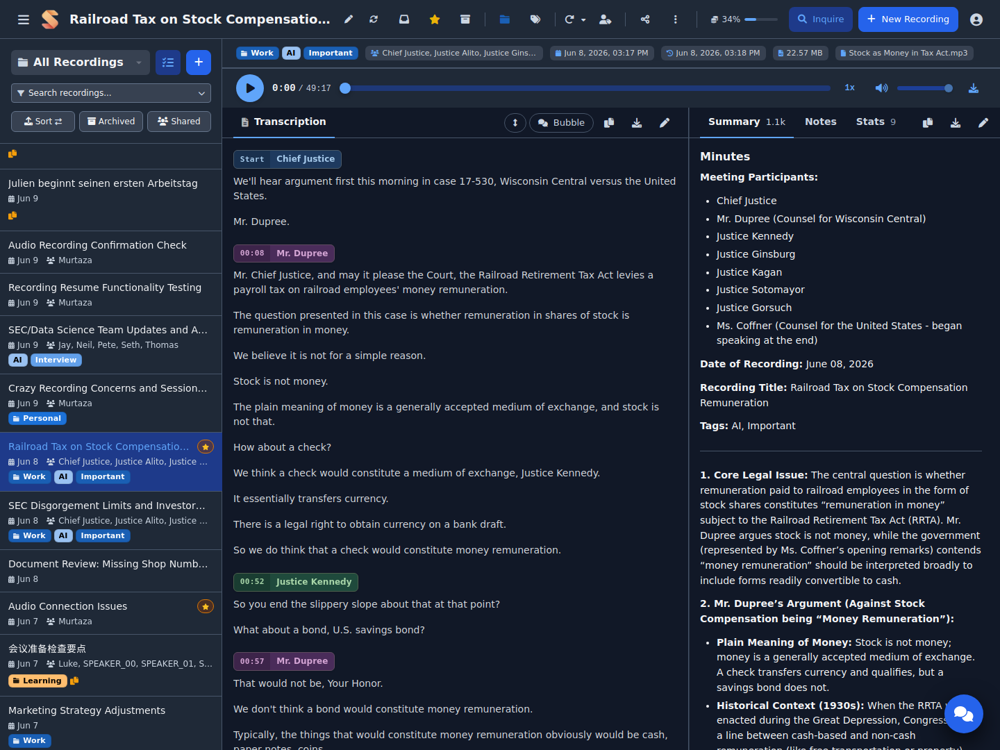
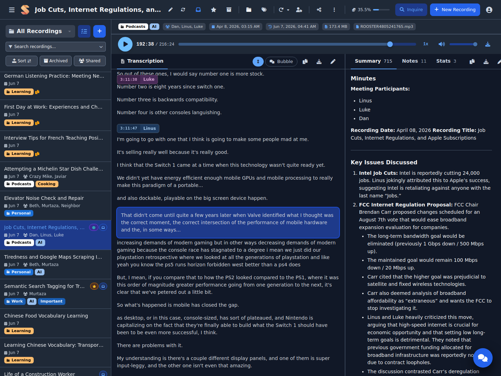

# Welcome to Speakr

Speakr is a powerful self-hosted transcription platform that helps you capture, transcribe, and understand your audio content. Whether you're recording meetings, interviews, lectures, or personal notes, Speakr transforms spoken words into valuable, searchable knowledge.

  

!!! success "Latest Release: v0.10.10-alpha: sidebar multi-select, configurable temperatures, no flicker"
    Several recordings can be selected in the sidebar with Ctrl-click (Cmd-click) and Shift-click. Generation temperatures can be set in the admin dashboard (#411). A recording started during a previous upload is no longer lost (#407), and pages no longer flicker while they load. No configuration changes are required.

    See the [full release notes](https://github.com/murtaza-nasir/speakr/releases/tag/v0.10.10-alpha) for details.

## Quick Navigation

  

    <h3>Getting Started</h3>
    
New to Speakr? Start here for a quick overview and setup guide.

    <a href="getting-started" class="card-link">Get Started →</a>
  

  
  

    <h3>Installation</h3>
    
Step-by-step instructions for Docker and manual installation.

    <a href="getting-started/installation" class="card-link">Install Now →</a>
  

  
  

    <h3>User Guide</h3>
    
Learn how to <a href="user-guide/recording">record</a>, <a href="user-guide/transcripts">transcribe</a>, and manage your audio content.

    <a href="user-guide/" class="card-link">Learn More →</a>
  

  
  

    <h3>Admin Guide</h3>
    
Configure <a href="admin-guide/user-management">users</a>, <a href="admin-guide/prompts">system settings</a>, and manage your instance.

    <a href="admin-guide/" class="card-link">Configure →</a>
  

  
  

    <h3>FAQ</h3>
    
Find answers to commonly asked questions about Speakr.

    <a href="faq" class="card-link">View FAQ →</a>
  

  
  

    <h3>Troubleshooting</h3>
    
Solutions for <a href="troubleshooting#transcription-problems">transcription issues</a> and <a href="troubleshooting#performance-issues">performance problems</a>.

    <a href="troubleshooting" class="card-link">Get Help →</a>
  

## Core Features

Speakr takes a recording from raw audio to organized, searchable, shareable knowledge. The pipeline:

  

    <h4>Capture</h4>
    <ul>
      <li><a href="user-guide/recording">Mic, system/tab audio, or both mixed</a></li>
      <li>Hours-long server-side recording sessions</li>
      <li>Drag-and-drop upload and black-hole auto-import</li>
    </ul>
  

  

    <h4>Transcribe</h4>
    <ul>
      <li><a href="features#multi-engine-support">Bring your own engine: WhisperX, OpenAI, Mistral, custom ASR</a></li>
      <li><a href="features#speaker-diarization">Speaker diarization</a> and <a href="features#speaker-management">voice profiles</a> (WhisperX backend)</li>
      <li><a href="features#language-support">Auto-detect plus the full Whisper language list</a></li>
      <li>Custom vocabulary and hotwords (most effective with WhisperX)</li>
    </ul>
  

  

    <h4>Understand</h4>
    <ul>
      <li><a href="features#automatic-summarization">Customizable AI summaries</a></li>
      <li>Event extraction and per-recording chat</li>
      <li><a href="user-guide/inquire-mode">Inquire Mode: semantic search across everything</a></li>
    </ul>
  

  

    <h4>Organize</h4>
    <ul>
      <li><a href="features#tagging-system">Smart tags with custom prompts, stackable</a></li>
      <li>Folders and bulk operations</li>
      <li><a href="features#retention-policies-and-auto-deletion">Retention policies and auto-deletion</a></li>
    </ul>
  

  

    <h4>Collaborate</h4>
    <ul>
      <li><a href="user-guide/sharing">Granular internal sharing and public links</a></li>
      <li>Groups with auto-share group tags</li>
      <li><a href="features#single-sign-on-sso">Multi-user with Single Sign-On (OIDC)</a></li>
    </ul>
  

  

    <h4>Automate</h4>
    <ul>
      <li><a href="user-guide/api-reference">REST API v1 with Swagger UI</a></li>
      <li><a href="features#webhooks">Signed webhooks</a> on lifecycle events</li>
      <li>n8n, Zapier, Make integration</li>
    </ul>
  

## Interactive Audio Synchronization

Experience seamless bidirectional synchronization between your audio and transcript. Click any part of the transcript to jump directly to that moment in the audio, or watch as the system automatically highlights the currently spoken text as the audio plays. Enable auto-scroll follow mode to keep the active segment centered in view, creating an effortless reading experience for even the longest recordings.

  
  
Real-time transcript highlighting synchronized with audio playback, with auto-scroll follow mode

Learn more about [audio synchronization features](user-guide/transcripts.md#audio-synchronization-and-follow-mode) in the user guide.

!!! tip "Transform Your Recordings with Custom Tag Prompts"
    Tags aren't just for organization - they transform content. Create a "Recipe" tag to convert cooking narration into formatted recipes. Use "Study Notes" tags to turn lecture recordings into organized outlines. Stack tags like "Client Meeting" + "Legal Review" for combined analysis. Learn more in the [Custom Prompts guide](admin-guide/prompts.md#creative-tag-prompt-use-cases).

## Latest Updates

!!! info "Version 0.10.10-alpha - Sidebar multi-select, configurable temperatures, no flicker"
    No database or configuration changes are required. To run from source, build the stylesheet with `scripts/build_css.sh`.

    - **Sidebar multi-select** - With Ctrl-click (Cmd-click on macOS), a recording is added to or removed from the selection, and with Shift-click, a range is selected.
    - **Generation temperatures** - Set in the admin dashboard, in the Default Prompts tab (#411).
    - **Recording safety** - A recording started during a previous upload is no longer lost when that upload finishes (#407).
    - **No flicker** - Pages are shown styled and translated from the first paint, with a short cross-fade between pages.
    - **Companion apps** - A new page lists unofficial community apps.

!!! info "Version 0.10.9-alpha - Header fix for the settings pages"
    No database or configuration changes are required.

    - **Settings page header** - The header controls and user menu are shown again on the Account, Admin and Group Management pages.

!!! info "Version 0.10.8-alpha - Startup model fix for whisperx-asr-service"
    No database or configuration changes are required.

    - **"Invalid model size ''" at startup (#409)** - The configured default transcription model is now sent with the voice embedding check, as with an upload.
    - **Model settings** - Incognito mode and bulk reprocessing use the configured model, hotwords and speaker counts; empty model names are never sent.
    - **Example admin address** - A container started from an unchanged example configuration no longer stops on `admin@example.com`.
    - **Tests for the documented setup** - Speakr and whisperx-asr-service are tested from their documented settings in CI.

!!! info "Version 0.10.7-alpha - Archive, joining files at upload, voice matching, and configurable titles"
    Database tables and columns are added automatically; no configuration changes are required.

    - **Archive and Audio removed (#394)** - Archive hides a recording from the main list and deletes nothing, per user like inbox and star. The retention state formerly called "Archived" is now **Audio removed**, with its own quick filter and a manual **Delete audio, keep transcript** action.
    - **Join files at upload** - With two or more files queued, choose **One recording** to join them in order and transcribe the result once.
    - **Voice matching rebuilt** - Profiles are built from per-recording samples forming one or more voice variants per person, kept separately per embedding model, with thresholds calibrated from your data.
    - **Identify Speakers dialog rebuilt (#395)** and **configurable AI title prompts (#400)** at tag, folder, user and admin level.
    - **Fixes** - SQLAlchemy capped below 2.1 for PostgreSQL (#401), the installed app is draggable again (#402), CSRF failures behind proxies explain themselves (#388), and API v1 deletes now remove media.

!!! note "Earlier releases"
    Release notes for v0.10.6 and earlier are on the [GitHub Releases page](https://github.com/murtaza-nasir/speakr/releases).

## Getting Help

Need assistance? We're here to help:

  

    <h4>Documentation</h4>
    
You're already here! Browse our comprehensive guides:

    <ul>
      <li><a href="faq">Frequently Asked Questions</a></li>
      <li><a href="troubleshooting">Troubleshooting Guide</a></li>
      <li><a href="user-guide/">User Documentation</a></li>
      <li><a href="admin-guide/">Admin Documentation</a></li>
    </ul>
  

  
  

    <h4>Community</h4>
    
Connect with other users and get support:

    <ul>
      <li><a href="https://github.com/murtaza-nasir/speakr/issues">Report Issues</a></li>
      <li><a href="https://github.com/murtaza-nasir/speakr/discussions">Join Discussions</a></li>
      <li><a href="https://github.com/murtaza-nasir/speakr">Star on GitHub</a></li>
    </ul>
  

---

Ready to transform your audio into actionable insights? [Get started now](getting-started.md) →