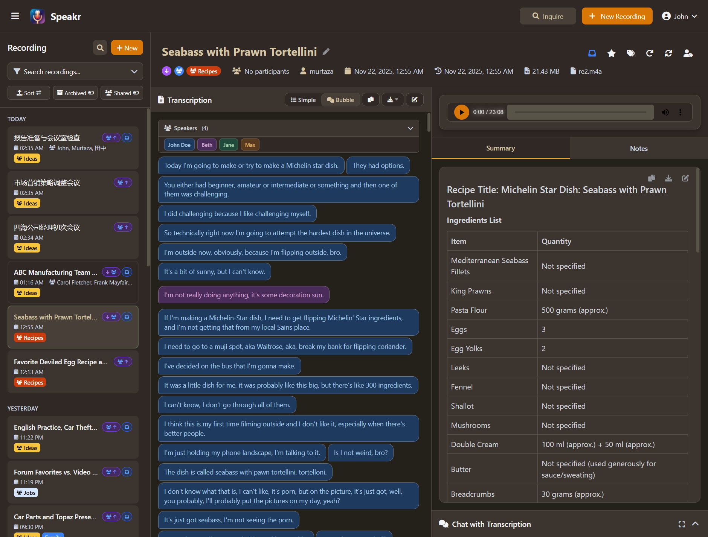

# Sharing & Collaboration

Speakr offers flexible collaboration options to match your workflow. Share recordings internally with group members for collaborative work, organize access through groups for seamless project management, or create public links for external stakeholders. Each sharing method serves different needs while maintaining security and control over your content.

## Internal Sharing (User-to-User)

Internal sharing enables direct collaboration between users in your Speakr instance. Share recordings one-on-one with family or colleagues, grant precise permissions based on trust levels, and maintain control over who can access your content.

### Understanding Internal Sharing

Unlike public share links that work for anyone with the URL, internal sharing creates secure connections between authenticated users within your Speakr instance. When you share internally, the recipient must log in to access the recording, and their permissions are tracked and enforceable. This makes internal sharing ideal for sensitive content and ongoing collaboration.

### Requirements for Internal Sharing

Your Speakr administrator must enable internal sharing before this feature becomes available. Once enabled, you'll see sharing buttons in the recording detail view. If you don't see these options, contact your administrator about enabling the `ENABLE_INTERNAL_SHARING` feature.

### Sharing a Recording with Another User

When viewing any recording you own, look for the blue users icon button in the toolbar. Clicking this opens the share modal where you can search for colleagues and configure access permissions.

The search functionality makes finding the right person quick and intuitive. Type at least two characters of a username to see matching results. The system filters out your own name since you can't share recordings with yourself, and shows only other users in your instance.

Before sharing, consider what level of access makes sense for this collaboration. Speakr offers three permission levels that build on each other, letting you grant exactly the access needed without oversharing control.

**View-Only Access** provides the foundation - recipients can read the transcription, review your summary and notes, listen to the audio if it hasn't been deleted, and use the AI chat feature to ask questions about the content. They cannot modify anything, ensuring your original content remains intact. This works well when you're distributing information but don't need input or edits.

**Edit Permissions** add the ability to modify the recording's metadata and shared content. Recipients with edit access can change the title, update participant lists, adjust the meeting date and time, modify the shared summary, and add or remove tags. However, they still cannot delete the recording or share it with others. Edit access works well for collaborative documentation where multiple group members contribute context and refinements. Note that all users can maintain their own personal notes regardless of edit permissions.

**Re-share Permissions** grant the highest level of access short of full ownership. Recipients can do everything editors can do, plus share the recording with additional users and manage those shares by revoking access. This creates a chain of trust where you empower certain colleagues to extend access as needed. However, even with re-share permissions, recipients cannot delete the recording - only the original owner can do that.

To share with view-only access, simply search for the user and click their name in the results. For edit or re-share permissions, check the appropriate boxes before clicking the username. The share takes effect immediately, and the recipient gains access to the recording in their main interface.

### Managing Your Shares

The unified share modal shows everyone who has access to a recording, making it easy to track and control sharing. Each entry displays the recipient's name, their permissions level, and when you granted access. The red user-times icon lets you instantly revoke access when collaboration ends or circumstances change.

Revoking access is immediate and thorough. When you revoke someone's access, they lose the ability to view the recording, and any personal notes they created on the shared recording are removed. This ensures complete separation when collaboration ends.

### Personal Notes on Shared Recordings

One of internal sharing's most powerful features is support for personal notes. When someone shares a recording with you, you can add your own private notes that only you can see. These personal notes never appear to the original owner or other recipients - they're your private space for observations, follow-ups, or context.

**Important: Notes vs. Summaries**
- **Notes**: Always personal and private. Each user (owner and shared recipients) can create their own notes that only they can see. No edit permission is required to add personal notes to a shared recording.
- **Summary**: Shared globally. The recording owner's AI-generated summary is visible to all users who have access to the recording. Only users with edit permission can modify the summary.

This separation means you can freely annotate shared recordings with your own thoughts and action items without cluttering the shared content or requiring special permissions. The owner maintains control over the official summary while everyone can maintain their own personal notes.

Personal notes persist until access is revoked. If the owner removes your access, your personal notes are automatically deleted since you no longer need notes on content you can't access. This automatic cleanup prevents orphaned data and maintains security.

### Independent Inbox and Favorite Status

Each user maintains their own inbox and favorite status for shared recordings. Your inbox and starred items are completely independent from other users - when you mark a shared recording as read or favorite it, this doesn't affect how it appears to the owner or other recipients. This allows everyone to organize their personal workspace without interfering with collaborators' views.

### Viewing Recordings Shared With You

Recordings that others have shared with you appear in your main recording list with distinctive visual indicators. Shared recordings display with an accent-colored title and a subtle border to make them immediately distinguishable from your own recordings. When you hover over a shared recording, you can see the owner's username (if your administrator has enabled username visibility), so you always know the content source.

The "Shared with Me" toggle in the sidebar filters your view to show only recordings that others have shared with you. This focused view helps when you need to review collaborative content without distraction from your own recordings.

Your permissions determine what you can do with shared recordings. View-only access means read and listen capabilities, while edit permissions let you contribute to the recording's metadata and shared summary. Regardless of your permission level, you can always add and edit your own personal notes - these are private to you and don't require any special permissions. The interface adapts to your permissions, showing or hiding controls based on your access level.

### Security and Privacy

Internal sharing implements multiple security layers to protect your content. Only authenticated users in your Speakr instance can receive shares - external parties cannot gain access through internal sharing mechanisms. Each share creates a tracked database record that links specific users to specific recordings with defined permissions.

The permission system enforces strict boundaries. View-only recipients cannot accidentally or intentionally modify content. Edit permissions don't include deletion rights, preventing data loss from collaborative editing. Re-share permissions create an audit trail of who granted access to whom, maintaining accountability.

When you delete a recording, all associated shares are automatically removed. Recipients lose access immediately, ensuring that content deletion is complete and final. Similarly, if an administrator disables a user's account, all their shares (both granted and received) become inactive.

### Practical Use Cases

Internal sharing and group features work together to handle different collaboration scenarios. Here's how people actually use them:

### One-on-One Sharing

Share individual recordings with specific people when you need targeted collaboration. Your manager asks about yesterday's client call - share it directly with view access so they can review what was discussed. A colleague missed the group meeting - share it with edit access so they can add their notes and questions. You're working on a project with someone from another department - share relevant recordings as you create them to keep them in the loop.

This works well when the collaboration is temporary or involves people who don't regularly need access to your recordings. You control exactly who sees what, and you can revoke access when the collaboration ends.

### Group-Based Sharing

Groups automate sharing for groups who regularly work together. Create an engineering group and apply group tags to architecture discussions - everyone on the group automatically gets access. Sales group members tag customer calls with group tags so the whole group learns from each interaction. HR group shares interview recordings with all interviewers without manually sharing each one.

Group sharing makes sense when the same group of people consistently needs access to similar content. Set it up once, and recordings flow to the right people automatically. The group structure persists, so new recordings tagged for the group reach all members without additional work.

### Combining Both Approaches

You can use groups for regular collaboration and individual sharing for exceptions. Your engineering group has automatic access to technical discussions through group tags. When a design decision needs executive review, you individually share that specific recording with your VP. The group gets their automated access, and you layer on targeted sharing for special cases.

This combination handles both routine collaboration (groups) and exceptional needs (individual shares) without creating organizational overhead.

### Real-World Scenarios

| Scenario | Approach | Why It Works |
|----------|----------|--------------|
| Family recording memories | Create "Family" group, tag trips and events | Everyone gets access automatically, can add their own notes |
| Book club discussions | Create "Book Club" group with protected tag | Recordings preserved permanently, all members auto-share |
| Work project with 3 people | Share individually with edit access | Temporary collaboration, easy to revoke when project ends |
| Department meetings | Create department group, tag all meetings | New group members get future meetings, not historical ones |
| Client presentations | Individual share with view-only | Controlled access, clients can't accidentally edit |
| Research group | Group with custom 7-year retention | Automatic sharing + compliance with retention policies |
| Daily standups | Group with 14-day retention | Auto-share with group, auto-cleanup of routine recordings |

### Combining with Retention Policies

Group tags can enforce retention policies that match how your group works. Your daily standup group tag auto-deletes recordings after two weeks since they're routine updates. Your architecture decisions group tag protects recordings permanently because those discussions document important choices. Your client calls group tag keeps recordings for one year to match your data retention policy.

This means the same recordings that automatically share with your group also automatically follow the right lifecycle. Tag it once, and both sharing and retention happen correctly.

## Best Practices for Internal Sharing

Share recordings promptly after meetings or discussions while context is fresh. Recipients can review content, add notes, and ask questions through the AI chat while details are still top-of-mind. This immediacy makes collaboration more effective and valuable.

Use view-only access by default, granting edit permissions only when recipients truly need to contribute. This prevents accidental modifications while still enabling information sharing. Reserve re-share permissions for trusted group leads or project managers who need to coordinate access for their groups.

Periodically review your shared recordings to ensure access remains appropriate. Group members change roles, projects end, and sensitive content that once needed sharing might now warrant restricted access. The manage shares interface makes regular audits quick and straightforward.

When collaborating on sensitive content, verify recipient permissions match their role and need. Legal discussions might need view-only access even for close colleagues, while brainstorming sessions benefit from liberal edit permissions. Match permissions to content sensitivity and collaboration needs.

## Public Share Links

Sometimes you need to share a recording with someone who doesn't have a Speakr account - perhaps a client needs to review a meeting, a colleague missed an important discussion, or you want to provide documentation to stakeholders. Speakr's public sharing feature lets you create secure, read-only links to your recordings while maintaining complete control over what information is shared.

### Understanding Public Shares

When you share a recording, Speakr generates a unique, secure link that provides access to that specific recording without requiring the recipient to log in or have an account. Each share link is cryptographically secure and impossible to guess, ensuring that only people you explicitly share with can access your content.

The sharing system gives you granular control over what recipients can see. You decide whether to include your AI-generated summary, your personal notes, or both. The transcription itself is always included, as it forms the core content of the recording. Recipients get a clean, professional view of your recording without any of the administrative interface or your other recordings.

## Requirements for Sharing

Before you can share recordings, your Speakr instance must meet two critical requirements. First, it must be accessible via HTTPS with a valid SSL certificate. Second, it must be reachable from the internet with a proper domain name or public IP address.

These requirements exist because share links need to be accessible to recipients who don't have accounts and may be accessing from anywhere. A local network installation or non-HTTPS setup cannot generate shareable links - the share button will either be disabled or display an error message explaining that sharing requires a secure, internet-accessible connection. If you're running Speakr internally without SSL or public access, you'll need to work with your IT group to set up proper HTTPS and internet routing before the sharing feature becomes available.

## Creating a Share Link

Once your instance meets the requirements, sharing a recording takes just a few clicks. While viewing any recording, click the share button in the toolbar to open the sharing modal. This presents you with two simple checkboxes that control what information will be visible to recipients.

The "Share Summary" option determines whether recipients can see the AI-generated summary of your recording. This is particularly useful when sharing with executives or stakeholders who need a quick overview without reading the entire transcription. The summary provides them with key points, decisions, and action items in a digestible format.

The "Share Notes" option controls whether your personal notes are visible. These are the markdown notes you've added to provide context, follow-ups, or additional thoughts about the recording. Consider carefully whether these notes are appropriate for your audience - they might contain internal observations or personal reminders that aren't meant for external viewing.

Once you've selected your options, click "Create Share Link" to generate the secure URL. The link appears immediately in the modal, ready to copy to your clipboard. This link is permanent until you explicitly revoke it, so recipients can bookmark it for future reference.

## What Recipients Experience

When someone clicks your share link, they're taken to a streamlined view of your recording designed for easy consumption without distractions. The interface is clean and professional, branded with Speakr but showing only the content you've chosen to share.

At the top of the page, recipients see the recording title prominently displayed along with a note indicating it's a shared recording. The audio player sits just below, providing full playback controls so they can listen to the original recording at their own pace. The player shows the total duration and current position, allowing recipients to navigate to specific moments or replay important sections.

The main content area is divided between the transcription and summary (if you've chosen to share it). The transcription appears with clear formatting, including speaker labels if your recording includes speaker diarization. Each identified speaker appears as a colored tag, making it easy to follow multi-person conversations. The interface includes view options like Simple and Bubble modes if speaker identification is present, and a copy button to easily extract the text.

If you've enabled summary sharing, it appears in a dedicated panel with its own copy functionality. The summary is rendered with full markdown formatting, presenting a professional overview of the key points from your recording. Your notes, if shared, would appear in a similar panel, providing additional context and insights.

At the bottom of the page, recipients see a subtle footer indicating the content is "Powered by advanced AI transcription" with a link to Speakr. This gives your shares a professional appearance while maintaining the focus on your content. The entire experience is read-only - recipients cannot edit anything, cannot access your other recordings, and cannot see any of your account information or settings.

## Managing Your Shared Recordings

All your shared recordings are centrally managed through the Shared Transcripts section in your account settings. This gives you a complete overview of everything you've shared and with whom.

The shared transcripts list shows each recording you've shared, when you created the share link, and what options you selected (summary and/or notes). Each entry includes the full share URL that you can copy again if needed - perhaps you've lost the original link or need to reshare with additional people.

You can modify what's included in a share by toggling the summary and notes checkboxes directly in this interface. These changes take effect immediately for anyone accessing the link. This is useful when you initially share just the transcription but later decide to include the summary, or when you want to remove notes that are no longer relevant.

The delete button next to each share instantly revokes access. Once deleted, the share link becomes invalid and anyone trying to access it will see an error message. This gives you complete control over the lifecycle of your shared content.

## Security and Privacy Considerations

Speakr requires HTTPS for all sharing operations, ensuring that share links can only be created and accessed over secure connections. This protects the content during transmission and prevents interception of sensitive recordings.

Each share link contains a cryptographically secure random token that's unique to that specific share. These tokens are generated using security best practices and are long enough to make guessing or brute-force attacks infeasible. Even if someone knows you've shared other recordings, they cannot derive or guess the links to those shares.

It's important to understand that share links don't require authentication - anyone with the link can access the recording. This makes sharing convenient but means you should treat these links with the same care you'd treat sensitive documents. Share them only through secure channels like encrypted email or private messages, never post them publicly, and revoke access when it's no longer needed.

The system doesn't track who accesses shared links or how often they're viewed. This respects recipient privacy but means you won't know if a link has been forwarded to others. If you need tighter access control, consider asking recipients to create Speakr accounts instead of using public sharing.

## Best Practices for Sharing

When sharing internally within your organization, you can generally include both summaries and notes since colleagues have context about the discussions and need complete information. The notes often contain valuable action items, follow-ups, and clarifications that help group members understand not just what was said, but what needs to happen next.

For external sharing with clients or partners, consider sharing only the summary without your internal notes. The summary provides them with professional, polished takeaways while your notes remain private for internal use. Review the content before sharing to ensure nothing confidential or inappropriate is included.

When sharing for documentation or compliance purposes, focus on the transcription itself as the authoritative record. The word-for-word transcription with timestamps provides an accurate account of what was discussed, while summaries and notes represent interpretations that might not be appropriate for official records.

Always review what you're sharing before sending the link. Once someone has accessed the content, they could save or screenshot it, so revoking the link later won't remove their access to information they've already viewed. If you realize you've shared something inappropriate, revoke the link immediately to prevent further access, but assume that previous viewers may have retained the information.

## Common Sharing Scenarios

Meeting participants often appreciate receiving a share link after important discussions. Include both the summary and notes to give them a complete picture of decisions made and actions required. This is especially valuable for participants who may have missed parts of the meeting or need to review specific details.

When updating clients on project progress, share recordings of internal discussions with summaries but without internal notes. This gives them transparency into your process and decisions while maintaining appropriate boundaries about internal deliberations.

For training and onboarding, shared recordings become valuable learning resources. New group members can listen to past discussions to understand project history, decision rationale, and group dynamics. Include comprehensive notes to provide context that might not be obvious from the transcription alone.

Legal and compliance groups may require unedited transcriptions of important conversations. In these cases, share only the transcription without summaries or notes that could be seen as interpretation or editorial commentary. The raw transcription provides an objective record of what was said.

## Limitations and Considerations

Share links are designed for occasional sharing with individuals or small groups, not for mass distribution or public posting. The system isn't optimized for hundreds of concurrent viewers, and publicly posted links could expose sensitive information to unintended audiences.

Currently, shares don't expire automatically, though this feature may be added in future updates. Once created, a share link remains valid until you manually revoke it. This means you should periodically review your shared recordings and remove access to those no longer needed.

The sharing feature is only available over HTTPS connections for security reasons. If you're running Speakr on a local network without SSL certificates, you won't be able to create share links. This is a deliberate security measure to prevent sensitive recordings from being shared over unencrypted connections.

Recipients need a modern web browser to view shared recordings. The audio player and transcription display require JavaScript and HTML5 support. While this covers the vast majority of users, recipients using very old browsers or restrictive corporate environments might experience issues.